## **Documento de Arquitetura de Software (DAS)**

### **Informações do Documento**
- **Projeto:** CSI - Customer Success Intelligence
- **Versão:** 2.0
- **Data:** 29/09/2025
- **Autor(es):** Luan Felipe Tavares
- **Revisor(es):** 

### **Histórico de Revisões**
| Versão | Data       | Autor        | Descrição das Alterações                          |
| ------ | ---------- | ------------ | ------------------------------------------------- |
| 1.0    | 27/06/2025 | Luan Tavares | Versão inicial do documento                       |
| 1.1    | 15/07/2025 | Luan Tavares | Atualização baseada nos requisitos v0.1 revisados |
| 2.0    | 29/09/2025 | Luan Tavares | Alinhamento completo com requisitos v1.0: <br/>- Inclusão de KPIs no MVP (RF-004, RF-005, RF-006)<br/>- Novos módulos: Contatos (RF-015), Indicadores BI (RF-017), Tipos Interação (RF-018)<br/>- Arquitetura atualizada com Power BI e jobs assíncronos<br/>- Sistema sem cache Redis (ADR-006)<br/>- Casos de uso detalhados para todos os RFs do MVP |

---

## **1. Introdução**

### **1.1 Finalidade**
O CSI (Customer Success Intelligence) é uma aplicação multi-tenant que centraliza todos os registros de interações com clientes, servindo como uma base de conhecimento inteligente para extrair relatórios e insights personalizados para diferentes perfis de usuários.

**Principais Funcionalidades:**
- **Gestão Multi-Tenant**: Suporte a múltiplas organizações com isolamento completo de dados
- **Perfis Hierárquicos**: Sistema de permissões baseado em perfis (HUB, Administrador, Usuário)
- **Integrações Múltiplas**: Importação automática de dados de ERP e sistema de suporte
- **Auditoria Completa**: Sistema de logs e métricas para usuários HUB

**Escopo do MVP:**
- Gestão de Segurança (Tenants, Perfis, Usuários, Permissões)
- Gestão de Clientes (Perfil do cliente, Gestão de Contatos)
- Gestão de Interações (Importação de interações dos sistemas legados, Cadastro manual)
- Gestão de KPIs (Criação, configuração e cálculo automático de indicadores)
- Dashboards (Visualização de KPIs e indicadores)
- Indicadores do BI (Módulos, Mensalidades, Custo de Servir, etc.)
- Monitoramento (Gestão de LOGs)
- Importação de dados: ERP Senior, Movidesk

**Escopo V2 (Pós-MVP):**
- Integração com RD Station
- Importação de dados dos sistemas: CRM Eleve, CRM Senior
- Sincronização bidirecional de contatos entre sistemas
- Agentes de IA para extração de informações
- Planos de Ação automatizados

O sistema opera de forma assíncrona para processamento de dados e cálculos, garantindo performance e disponibilidade durante operações críticas.

### **1.2 Escopo**
Consta neste documento uma visão geral sobre a arquitetura bem como as decisões arquiteturais e suas justificativas, restrições, premissas, além da visão de componentes, módulos e modelos de dados de alto nível.

### **1.3 Definições, Acrônimos e Abreviações**
| Termo     | Definição                                            |
| --------- | ---------------------------------------------------- |
| CSI       | Customer Success Intelligence                        |
| SLA       | Service Level Agreement - Acordo de Nível de Serviço |
| API       | Application Programming Interface                    |
| REST      | Representational State Transfer                      |
| JWT       | JSON Web Token                                       |
| LGPD      | Lei Geral de Proteção de Dados                       |
| CRM       | Customer Relationship Management                     |
| KPI       | Key Performance Indicator                            |
| Dashboard | Painel de visualização de dados                      |
| Webhook   | Callback HTTP automático                             |
| RBAC      | Role-Based Access Control                            |
| MRR       | Monthly Recurring Revenue                            |
| Tenant    | Instância isolada de dados no sistema multi-tenant  |
| HUB       | Perfil de usuário com acesso administrativo global   |
| NPS       | Net Promoter Score - Métrica de satisfação          |
| ERP       | Enterprise Resource Planning                         |

### **1.4 Referências**
- [Documentação de Requisitos do CSI v1.0](./1%20Documentação%20de%20Requisitos%20do%20CSI%20v1.0.md)
- [Diagramas Arquiteturais](./3%20Diagramas%20Arquiteturais.md)
- [Especificações Técnicas](./4%20Especificações%20Técnicas.md)
- [Documentação da Estrutura](./5%20Documentação%20da%20Estrutura.md)
- [Sistema de Permissões](./6%20Sistema%20de%20Permissões.md)
- [Guia de Comandos Docker](./7%20Guia%20de%20Comandos%20Docker.md)
- Template Laravel Vue [GitHub](https://github.com/antoniv-informatica-ltda/template-laravel-vue)
- LGPD - Lei nº [13.709/2018](https://www.planalto.gov.br/ccivil_03/_ato2015-2018/2018/lei/l13709.htm)

### **1.5 Visão Geral do Documento**
Este documento está organizado em 14 seções principais:
- **Seções 1-3**: Introdução, visão arquitetural e objetivos do sistema
- **Seções 4-9**: Diferentes visões da arquitetura (casos de uso, lógica, processos, implantação, implementação e dados)
- **Seções 10-11**: Requisitos não-funcionais e atributos de qualidade
- **Seções 12-13**: Decisões arquiteturais e gestão de riscos
- **Seção 14**: Material complementar e referências

O documento fornece uma visão completa da arquitetura do CSI, servindo como guia para desenvolvimento, manutenção e evolução do sistema.

### **1.6 Contexto Organizacional**

#### **1.6.1 Estrutura da Equipe**
- **Tamanho atual**: 5 pessoas
- **Composição**:
  - Dev FullStack: 3
  - Arquiteto: 1 
- **Senioridade média**: Júnior/Pleno
- **Experiência com as tecnologias**: Média
- **Especialização**: Equipe com conhecimento em Laravel/Vue.js

#### **1.6.2 Modelo de Trabalho**
- **Localização**: Presencial
- **Fuso horário**: Mesmo fuso
- **Metodologia**: Scrum/Kanban

## **2. Representação Arquitetural**

### **2.1 Visão Geral**
O CSI utiliza uma arquitetura MVC modular monolítica, aproveitando o framework Laravel para o backend e Vue.js para o frontend. A aplicação é hospedada na Microsoft Azure, utilizando seus serviços gerenciados para garantir escalabilidade e confiabilidade.

### **2.2 Diagrama de Arquitetura de Alto Nível**

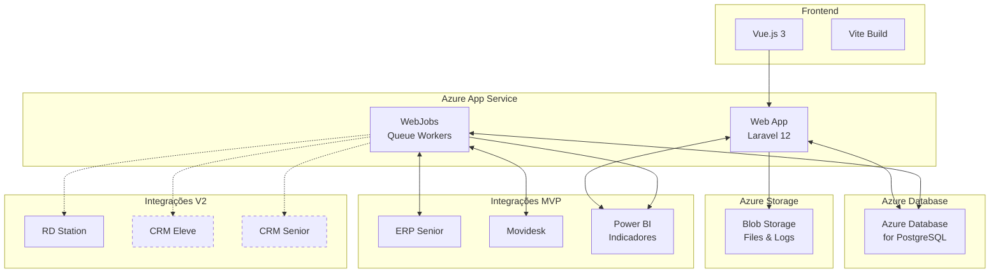
```mermaid
graph TB
    subgraph "Frontend"
        VUE[Vue.js 3]
        VITE[Vite Build]
    end
    
    subgraph "Azure App Service"
        WEB[Web App<br/>Laravel 12]
        WORKER[WebJobs<br/>Queue Workers]
    end
    
    subgraph "Azure Database"
        PGSQL[Azure Database<br/>for PostgreSQL]
    end
    
    subgraph "Azure Storage"
        BLOB[Blob Storage<br/>Files & Logs]
    end
    
    subgraph "Integrações MVP"
        ERP[ERP Senior]
        DESK[Movidesk]
        BI[Power BI<br/>Indicadores]
    end
    
    subgraph "Integrações V2"
        RD[RD Station]
        CRM1[CRM Eleve]
        CRM2[CRM Senior]
    end
    
    VUE --> WEB
    WEB <--> PGSQL
    WEB --> BLOB
    WEB <--> BI
    WORKER <--> PGSQL
    WORKER <--> ERP
    WORKER <--> DESK
    WORKER --> BI
    WORKER -.-> RD
    WORKER -.-> CRM1
    WORKER -.-> CRM2
    
    style CRM1 stroke-dasharray: 5 5
    style CRM2 stroke-dasharray: 5 5
```

**Legenda:**
- **Linhas sólidas**: Integrações e serviços incluídos no MVP
- **Linhas tracejadas**: Integrações planejadas para V2
- **Power BI**: Fonte de indicadores pré-processados
- **PostgreSQL**: Banco principal com KPIs pré-calculados (sem cache)

### **2.3 Padrões Arquiteturais**
- **MVC (Model-View-Controller)**: Padrão principal do Laravel
- **Repository Pattern**: Para abstração de acesso a dados
- **Service Layer**: Para lógica de negócio complexa
- **Observer Pattern**: Para eventos e notificações
- **Queue-Based Processing**: Para tarefas assíncronas

---

## **3. Objetivos e Restrições Arquiteturais**

### **3.1 Objetivos**
1. **Simplicidade**: Arquitetura compreensível
2. **Modularidade**: Código organizado em módulos independentes
3. **Performance**: Interface responsiva e consultas otimizadas
4. **Confiabilidade**: 95% de uptime mensal
5. **Manutenibilidade**: Código limpo e bem documentado

### **3.2 Restrições**

#### **Restrições Técnicas**
- Utilizar template Laravel/Vue existente da Sancon
- Hospedar exclusivamente em Microsoft Azure
- PHP 8.4 e Laravel 12
- PostgreSQL como banco de dados principal
- Vue.js 3 para frontend

#### **Restrições Organizacionais**
- Equipe de 5 pessoas (limitação de recursos)
- Prazo de 6 meses para MVP
- Orçamento limitado para infraestrutura
- Conformidade com LGPD

#### **Restrições de Integração**
- APIs dos sistemas legados são variáveis
- Formatos de dados heterogêneos

---

## **4. Visão de Casos de Uso**

### **4.1 Atores do Sistema**

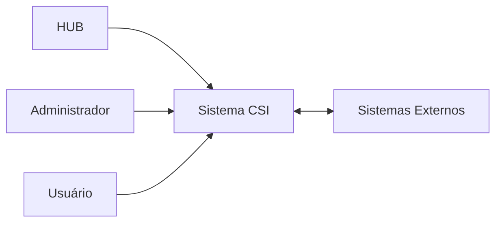
```mermaid
graph LR
    HUB[HUB]
    ADM[Administrador]
    USR[Usuário]
    SYS[Sistema CSI]
    EXT[Sistemas Externos]
    
    HUB --> SYS
    ADM --> SYS
    USR --> SYS
    SYS <--> EXT
```

**Descrição dos Atores:**
- **HUB**: Gerencia os tenants, monitora logs, acessa qualquer cliente. Nível técnico alto.
- **Administrador**: Gerencia usuários, perfis e configurações do tenant. Nível técnico médio.
- **Usuário**: Acessa dados e relatórios liberados para o seu perfil. Nível técnico baixo.
- **Sistema CSI**: Representa tarefas agendadas e processamentos automáticos.
- **Sistemas Externos**: Fontes externas de dados (ERP, Movidesk, RD Station).

### **4.2 Casos de Uso Principais**

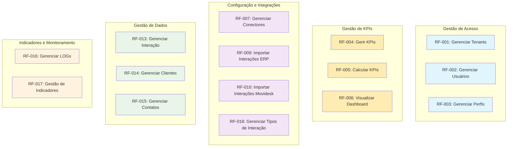
```mermaid
graph TB
    subgraph "Gestão de Acesso"
        UC1[RF-001: Gerenciar Tenants]
        UC2[RF-002: Gerenciar Usuários]
        UC3[RF-003: Gerenciar Perfis]
    end
    
    subgraph "Gestão de KPIs"
        UC4[RF-004: Gerir KPIs]
        UC5[RF-005: Calcular KPIs]
        UC6[RF-006: Visualizar Dashboard]
    end
    
    subgraph "Configuração e Integrações"
        UC7[RF-007: Gerenciar Conectores]
        UC9[RF-009: Importar Interações ERP]
        UC10[RF-010: Importar Interações Movidesk]
        UC18[RF-018: Gerenciar Tipos de Interação]
    end
    
    subgraph "Gestão de Dados"
        UC13[RF-013: Gerenciar Interação]
        UC14[RF-014: Gerenciar Clientes]
        UC15[RF-015: Gerenciar Contatos]
    end
    
    subgraph "Indicadores e Monitoramento"
        UC16[RF-016: Gerenciar LOGs]
        UC17[RF-017: Gestão de Indicadores]
    end
    
    style UC1 fill:#e1f5fe
    style UC2 fill:#e1f5fe
    style UC3 fill:#e1f5fe
    style UC4 fill:#ffecb3
    style UC5 fill:#ffecb3
    style UC6 fill:#ffecb3
    style UC7 fill:#f3e5f5
    style UC9 fill:#f3e5f5
    style UC10 fill:#f3e5f5
    style UC18 fill:#f3e5f5
    style UC13 fill:#e8f5e8
    style UC14 fill:#e8f5e8
    style UC15 fill:#e8f5e8
    style UC16 fill:#fff3e0
    style UC17 fill:#fff3e0
```

## **4.3 Fluxo de Casos de Uso Críticos**

**Casos de Uso do MVP:**
- **RF-001**: Gerenciar Tenants (UC1) - *Gestão de organizações multi-tenant*
- **RF-002**: Gerenciar Usuários (UC2) - *Gestão de usuários do sistema*
- **RF-003**: Gerenciar Perfis (UC3) - *Gestão de perfis e permissões*
- **RF-004**: Gerir KPIs (UC4) - *Configuração e gestão de indicadores*
- **RF-005**: Calcular KPIs (UC5) - *Processamento automático dos cálculos*
- **RF-006**: Visualizar Dashboard (UC6) - *Interface de dashboards e KPIs*
- **RF-007**: Gerenciar Conectores (UC7) - *Configuração de integrações*
- **RF-009**: Importar Interações ERP (UC9) - *Integração com ERP Senior*
- **RF-010**: Importar Interações Movidesk (UC10) - *Integração com Movidesk*
- **RF-013**: Gerenciar Interação (UC13) - *Cadastro manual de interações*
- **RF-014**: Gerenciar Clientes (UC14) - *Gestão de dados de clientes*
- **RF-015**: Gerenciar Contatos (UC15) - *Gestão de contatos dos clientes*
- **RF-016**: Gerenciar LOGs (UC16) - *Sistema de auditoria e monitoramento*
- **RF-017**: Gestão de Indicadores (UC17) - *Consulta de indicadores do BI*
- **RF-018**: Gerenciar Tipos de Interação (UC18) - *Configuração de tipos de interação*

**Casos de Uso para V2:**
- **RF-011**: Importar Interações CRM Eleve (UC11) - *Integração com CRM Eleve*
- **RF-012**: Importar Interações RD Station (UC12) - *Integração com RD Station*
- **Sincronização Bidirecional de Contatos** - *Espelhamento para sistemas legados*
- **Agentes de IA** - *Extração inteligente de informações*
- **Planos de Ação** - *Automatização de ações baseadas em KPIs*

### **UC1: Gerenciar Tenants (RF-001)**

**Descrição do Processo:**
Este caso de uso permite que usuários HUB gerenciem tenants (organizações) no sistema, controlando qual empresa/cliente tem acesso ao CSI. Cada tenant representa uma instância isolada de dados no sistema multi-tenant.

**Fluxo Principal:**
1. O usuário HUB acessa a tela de gestão de tenants através do menu administrativo
2. O sistema carrega e exibe uma grid com todos os tenants cadastrados
3. Filtros estão disponíveis para pesquisar por nome e status (ativo/inativo)
4. Para criar um novo tenant, o HUB clica no botão "Novo Tenant"
5. Um modal é apresentado com os campos: nome do tenant e status ativo/inativo
6. O sistema valida se o nome é único no sistema
7. Ao salvar, o tenant é criado com estrutura de dados isolada
8. Um log de auditoria é criado automaticamente registrando a ação
9. A grid é atualizada mostrando o novo tenant

**Regras de Negócio:**
- Nome do tenant deve ser único no sistema
- Apenas usuários HUB podem gerenciar tenants
- Tenants inativos mantêm dados mas impedem login de usuários
- Exclusão de tenant requer confirmação e backup de dados
- Sistema deve registrar quem e quando o tenant foi alterado

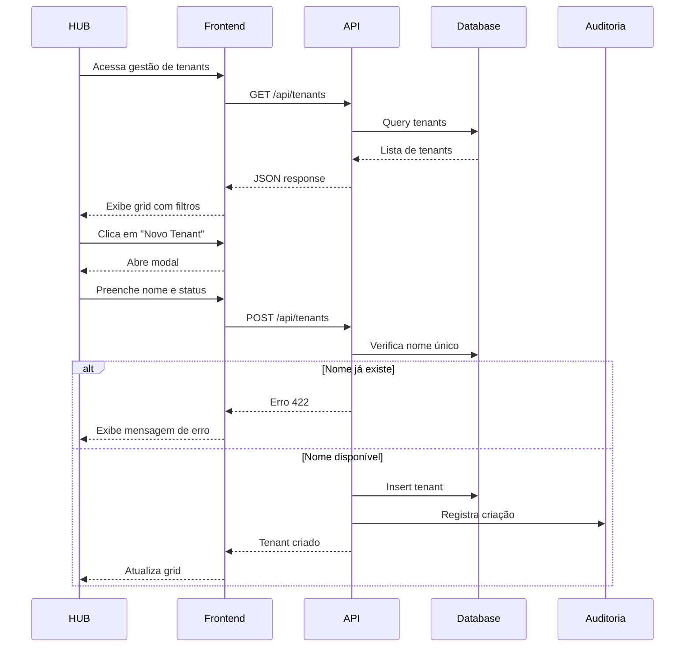
```mermaid
sequenceDiagram
    participant H as HUB
    participant F as Frontend
    participant API as API
    participant DB as Database
    participant LOG as Auditoria
    
    H->>F: Acessa gestão de tenants
    F->>API: GET /api/tenants
    API->>DB: Query tenants
    DB-->>API: Lista de tenants
    API-->>F: JSON response
    F-->>H: Exibe grid com filtros
    
    H->>F: Clica em "Novo Tenant"
    F-->>H: Abre modal
    H->>F: Preenche nome e status
    F->>API: POST /api/tenants
    API->>DB: Verifica nome único
    alt Nome já existe
        API-->>F: Erro 422
        F-->>H: Exibe mensagem de erro
    else Nome disponível
        API->>DB: Insert tenant
        API->>LOG: Registra criação
        API-->>F: Tenant criado
        F-->>H: Atualiza grid
    end
```

---

### **UC2: Gerenciar Usuários (RF-002)**

**Descrição do Processo:**
Este caso de uso permite que administradores gerenciem o acesso ao sistema através da criação, edição e desativação de usuários. O processo garante que cada login seja único no sistema e permite a associação de perfis aos usuários.

**Fluxo Principal:**
1. O administrador acessa a tela de gestão de usuários através do menu principal
2. O sistema carrega e exibe uma grid paginada com todos os usuários cadastrados
3. Filtros estão disponíveis para pesquisar por nome, login e status (ativo/inativo)
4. Para criar um novo usuário, o administrador clica no botão "Novo Usuário"
5. Um modal é apresentado com os campos: nome completo, login, senha e status ativo/inativo
6. O modal inclui uma seção para gerenciar perfis do usuário:
   - Lista de perfis já associados ao usuário
   - Lista de perfis disponíveis para associação
   - Botões para adicionar/remover perfis
7. O sistema valida em tempo real se o login escolhido já existe
8. Ao salvar, o sistema criptografa a senha usando bcrypt e registra o usuário
9. As associações de perfis são salvas na tabela de relacionamento
10. Um log de auditoria é criado registrando quem e quando alterou o usuário
11. A grid é atualizada sem necessidade de refresh da página

**Regras de Negócio:**
- Login deve ser único no sistema
- Apenas administradores podem criar/editar usuários
- Usuários não podem ser excluídos, apenas desativados
- Sistema deve registrar quem e quando o usuário foi alterado
- Mudanças nos perfis do usuário afetam imediatamente suas permissões

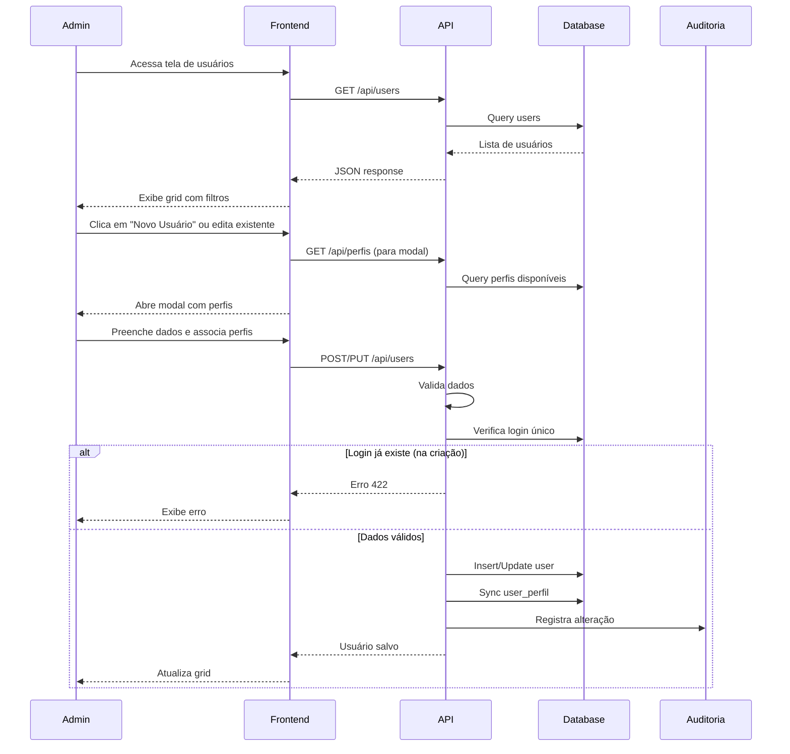
```mermaid
sequenceDiagram
    participant A as Admin
    participant F as Frontend
    participant API as API
    participant DB as Database
    participant LOG as Auditoria
    
    A->>F: Acessa tela de usuários
    F->>API: GET /api/users
    API->>DB: Query users
    DB-->>API: Lista de usuários
    API-->>F: JSON response
    F-->>A: Exibe grid com filtros
    
    A->>F: Clica em "Novo Usuário" ou edita existente
    F->>API: GET /api/perfis (para modal)
    API->>DB: Query perfis disponíveis
    F-->>A: Abre modal com perfis
    
    A->>F: Preenche dados e associa perfis
    F->>API: POST/PUT /api/users
    API->>API: Valida dados
    API->>DB: Verifica login único
    alt Login já existe (na criação)
        API-->>F: Erro 422
        F-->>A: Exibe erro
    else Dados válidos
        API->>DB: Insert/Update user
        API->>DB: Sync user_perfil
        API->>LOG: Registra alteração
        API-->>F: Usuário salvo
        F-->>A: Atualiza grid
    end
```

---

### **UC3: Gerenciar Perfis (RF-003)**

**Descrição do Processo:**
Este caso de uso permite que administradores e usuários HUB gerenciem perfis de usuário, definindo quais KPIs cada perfil pode acessar e quais usuários pertencem a cada perfil.

**Fluxo Principal:**
1. O administrador acessa a tela de gestão de perfis
2. O sistema exibe todos os perfis cadastrados com filtros por nome e status
3. Para criar um novo perfil, clica no botão "Novo Perfil"
4. Um modal é apresentado com:
   - Nome e descrição do perfil
   - Lista de usuários associados ao perfil (com opção de adicionar/remover)
   - A ser definido (Lista de KPIs associados ao perfil (com opção de adicionar/remover))
5. O sistema valida se o nome do perfil é único
6. Ao salvar, todas as associações são atualizadas
7. Perfis especiais (HUB e Administrador) têm restrições:
   - Não permitem edição de nome/descrição
   - Não mostram lista de KPIs (acesso total)
   - Apenas permitem associar/desassociar usuários

**Regras de Negócio:**
- Nome do perfil deve ser único no sistema
- Perfis HUB e Administrador são protegidos contra alterações estruturais
- Sistema deve registrar quem e quando o perfil foi criado/alterado
- Mudanças em perfis afetam imediatamente todos os usuários vinculados

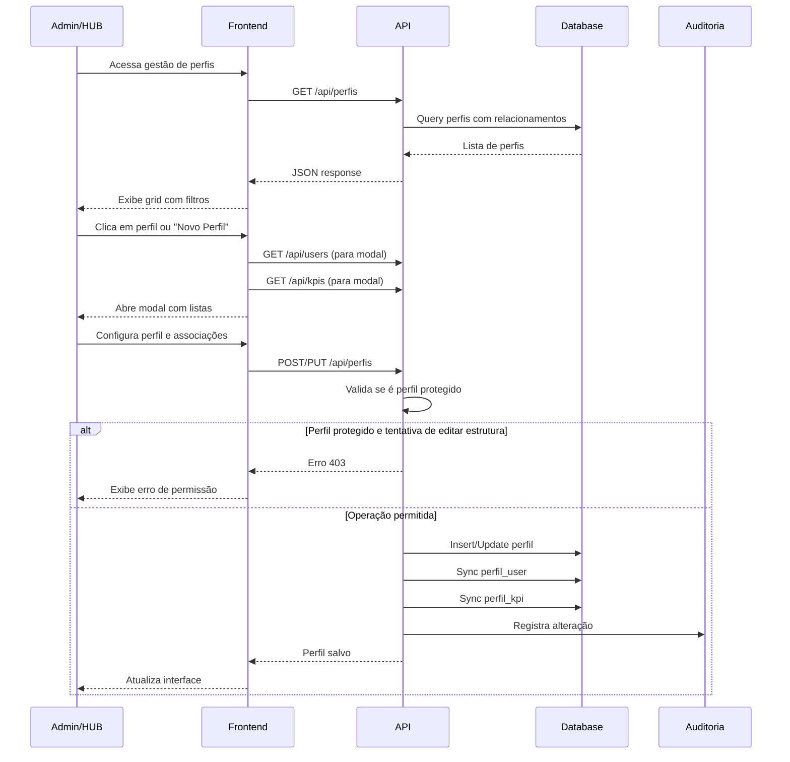
```mermaid
sequenceDiagram
    participant A as Admin/HUB
    participant F as Frontend
    participant API as API
    participant DB as Database
    participant LOG as Auditoria
    
    A->>F: Acessa gestão de perfis
    F->>API: GET /api/perfis
    API->>DB: Query perfis com relacionamentos
    DB-->>API: Lista de perfis
    API-->>F: JSON response
    F-->>A: Exibe grid com filtros
    
    A->>F: Clica em perfil ou "Novo Perfil"
    F->>API: GET /api/users (para modal)
    F->>API: GET /api/kpis (para modal)
    F-->>A: Abre modal com listas
    
    A->>F: Configura perfil e associações
    F->>API: POST/PUT /api/perfis
    API->>API: Valida se é perfil protegido
    alt Perfil protegido e tentativa de editar estrutura
        API-->>F: Erro 403
        F-->>A: Exibe erro de permissão
    else Operação permitida
        API->>DB: Insert/Update perfil
        API->>DB: Sync perfil_user
        API->>DB: Sync perfil_kpi
        API->>LOG: Registra alteração
        API-->>F: Perfil salvo
        F-->>A: Atualiza interface
    end
```

---

### **UC4: Gerir KPIs (RF-004)**

**Descrição do Processo:**
Este caso de uso permite que usuários autorizados criem e configurem KPIs customizados usando fórmulas matemáticas. Cada KPI pode referenciar tipos de interação ou outros KPIs, criando indicadores complexos e personalizados por tenant.

**Fluxo Principal:**
1. O usuário acessa a tela de gestão de KPIs através do menu administrativo
2. O sistema exibe uma grid com os KPIs já cadastrados, permitindo pesquisa por descrição
3. Para criar um novo KPI, o usuário clica em "Novo KPI"
4. Uma tela de edição é apresentada com duas abas:
   - **Dados Gerais**: ID, Descrição do KPI
   - **Configurações**: Data, CRON, Operação, Fórmula e Base de cálculo
5. Na aba de configuração, o usuário define:
   - **Operação**: Soma, Média, Mínimo, Máximo, Contagem ou Fórmula
   - **Base**: Grid com sequência, tipo (Tipo Interação ou KPI), e ID da referência
   - **Fórmula**: Só aparece quando operação for "Fórmula"
6. O sistema valida referências circulares e sintaxe matemática
7. Ao salvar, cria-se o histórico de configuração com timestamp

**Sintaxe de Fórmulas:**
- Operações matemáticas: `+`, `-`, `*`, `/`
- Agrupadores: `(` e `)`
- Variáveis: Referências aos itens da base (ex: `KPI1`, `TipoInteracao2`)
- Valores fixos: Números (ex: `100`)
- Exemplo: `((KPI1 * KPI2) / 100)`

**Regras de Negócio:**
- Cada KPI pertence a um tenant específico
- Não pode haver referência circular (KPI depender de si próprio)
- Fórmula deve ter sintaxe matemática válida
- Sistema mantém histórico de configurações por data
- Validação de dependências ao salvar alterações

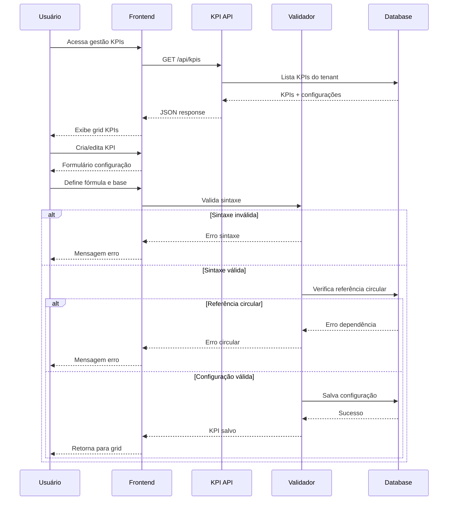
```mermaid
sequenceDiagram
    participant U as Usuário
    participant F as Frontend
    participant API as KPI API
    participant V as Validador
    participant DB as Database
    
    U->>F: Acessa gestão KPIs
    F->>API: GET /api/kpis
    API->>DB: Lista KPIs do tenant
    DB-->>API: KPIs + configurações
    API-->>F: JSON response
    F-->>U: Exibe grid KPIs
    
    U->>F: Cria/edita KPI
    F-->>U: Formulário configuração
    U->>F: Define fórmula e base
    F->>V: Valida sintaxe
    alt Sintaxe inválida
        V-->>F: Erro sintaxe
        F-->>U: Mensagem erro
    else Sintaxe válida
        V->>DB: Verifica referência circular
        alt Referência circular
            DB-->>V: Erro dependência
            V-->>F: Erro circular
            F-->>U: Mensagem erro
        else Configuração válida
            V->>DB: Salva configuração
            DB-->>V: Sucesso
            V-->>F: KPI salvo
            F-->>U: Retorna para grid
        end
    end
```

---

### **UC5: Calcular KPIs (RF-005)**

**Descrição do Processo:**
O cálculo de KPIs é executado através de dois jobs assíncronos: um orquestrador que define quando calcular e organiza as dependências, e outro que executa os cálculos efetivamente. O processo garante que dependências sejam resolvidas na ordem correta.

**Fluxo Principal:**
1. **Job Orquestrador** (executa a cada hora):
   - Percorre todos os tenants ativos
   - Para cada tenant, verifica KPIs que precisam ser recalculados usando CRON
   - Analisa dependências entre KPIs e define ordem de cálculo
   - Busca todos os clientes ativos do tenant
   - Adiciona na fila de cálculo: {tenant, KPIs ordenados, clientes}
   
2. **Job Cálculo** (monitora fila continuamente):
   - Para cada item na fila, processa tenant + KPIs + clientes
   - Para cada KPI e cliente:
     - Insere registro na tabela `KPI_Calculado` com status 'CALCULANDO'
     - Executa cálculo baseado na operação configurada
     - Atualiza status: 'SUCESSO', 'ERRO' ou 'PENDENTE_DEPENDENCIA'
     - Registra tempo de execução
   - Calcula também KPI geral (sem cliente específico)
   - Remove item da fila ao finalizar

**Otimizações de Performance:**
- KPIs pré-calculados armazenados em banco
- Processamento paralelo por tenant
- Batch de inserções no banco
- Timeout configurável para cálculos complexos

**Regras de Negócio:**
- KPIs com dependências só calculam após suas dependências
- Erros em um cliente não impedem cálculo dos demais
- Sistema registra logs detalhados de execução
- Tempo limite de 5 minutos por cálculo individual

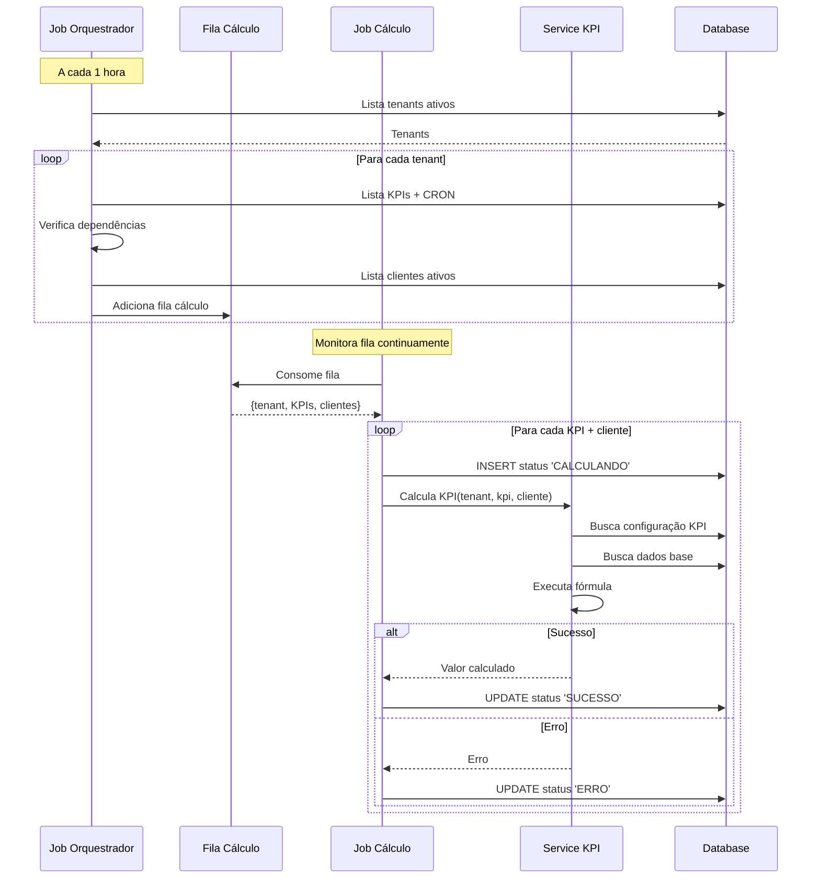
```mermaid
sequenceDiagram
    participant O as Job Orquestrador
    participant Q as Fila Cálculo
    participant C as Job Cálculo
    participant S as Service KPI
    participant DB as Database
    
    Note over O: A cada 1 hora
    O->>DB: Lista tenants ativos
    DB-->>O: Tenants
    loop Para cada tenant
        O->>DB: Lista KPIs + CRON
        O->>O: Verifica dependências
        O->>DB: Lista clientes ativos
        O->>Q: Adiciona fila cálculo
    end
    
    Note over C: Monitora fila continuamente
    C->>Q: Consome fila
    Q-->>C: {tenant, KPIs, clientes}
    loop Para cada KPI + cliente
        C->>DB: INSERT status 'CALCULANDO'
        C->>S: Calcula KPI(tenant, kpi, cliente)
        S->>DB: Busca configuração KPI
        S->>DB: Busca dados base
        S->>S: Executa fórmula
        alt Sucesso
            S-->>C: Valor calculado
            C->>DB: UPDATE status 'SUCESSO'
        else Erro
            S-->>C: Erro
            C->>DB: UPDATE status 'ERRO'
        end
    end
```

---

### **UC6: Visualizar Dashboard (RF-006)**

**Descrição do Processo:**
O dashboard apresenta os KPIs calculados em formato de cards responsivos, permitindo que usuários analisem indicadores conforme suas permissões. A interface permite filtrar por cliente e data de referência.

**Fluxo Principal:**
1. O usuário acessa o dashboard através do menu principal
2. Sistema identifica KPIs liberados para o perfil do usuário
3. Interface carrega dados da data atual para todos os clientes
4. KPIs são exibidos em cards com:
   - Nome do KPI
   - Valor calculado (ou "Sem dados" se não calculado)
   - Data de referência
   - Indicador visual de status
5. Usuário pode filtrar por:
   - Cliente específico ou "Todos"
   - Data de referência
6. Aplicação de filtros recarrega dados via AJAX
7. Cards são atualizados sem refresh da página

**Interface e Usabilidade:**
- Layout responsivo com grid adaptável
- Cards coloridos baseados em status (sucesso/erro/pendente)
- Loading states durante carregamento
- Mensagens informativas para KPIs sem dados
- Filtros com autocomplete para clientes

**Regras de Negócio:**
- Usuário só vê KPIs associados ao seu perfil
- Data padrão é sempre atual
- Sistema trata KPIs sem valor calculado
- KPIs pré-calculados garantem performance
- Logs de acesso para auditoria

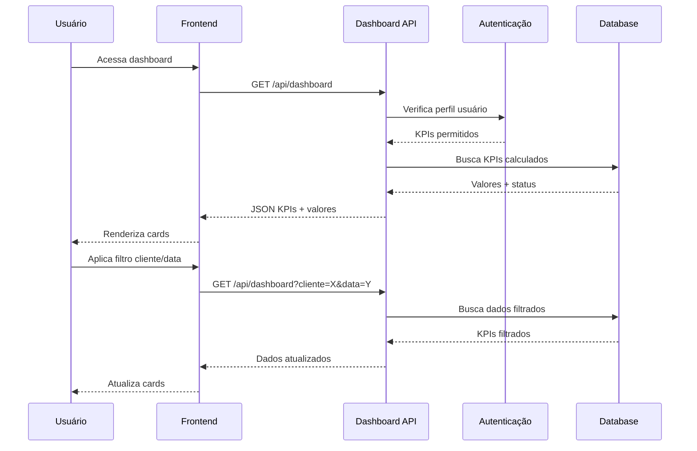
```mermaid
sequenceDiagram
    participant U as Usuário
    participant F as Frontend
    participant API as Dashboard API
    participant AUTH as Autenticação
    participant DB as Database
    
    U->>F: Acessa dashboard
    F->>API: GET /api/dashboard
    API->>AUTH: Verifica perfil usuário
    AUTH-->>API: KPIs permitidos
    API->>DB: Busca KPIs calculados
    DB-->>API: Valores + status
    API-->>F: JSON KPIs + valores
    F-->>U: Renderiza cards
    
    U->>F: Aplica filtro cliente/data
    F->>API: GET /api/dashboard?cliente=X&data=Y
    API->>DB: Busca dados filtrados
    DB-->>API: KPIs filtrados
    API-->>F: Dados atualizados
    F-->>U: Atualiza cards
```

---

### **UC7: Importar Clientes**

**Descrição do Processo:**
A importação de clientes é executada diariamente para manter o cadastro sincronizado com o ERP Senior. O processo é incremental, importando apenas clientes novos ou com alterações.

**Fluxo Principal:**
1. O scheduler dispara o job de importação
2. O sistema consulta o timestamp da última importação bem-sucedida
3. Uma requisição é feita ao WebService ConsultarGeral_2 do ERP
4. Para cada cliente retornado:
   - Verifica se já existe pelo CNPJ/CPF
   - Se novo: cria registro completo
   - Se existente: compara e atualiza apenas campos alterados
5. Validações são aplicadas:
   - CNPJ/CPF válido
   - Código Senior único
   - Dados obrigatórios preenchidos
6. Um relatório de importação é gerado com:
   - Total de registros processados
   - Clientes criados/atualizados
   - Erros encontrados
7. Em caso de falha total, notificação é enviada à equipe

**Tratamento de Erros:**
- Timeout de 30 segundos por requisição
- Retry automático até 3 vezes com intervalo crescente
- Clientes com erro são marcados para revisão manual
- Importação parcial é permitida (não é tudo ou nada)

**Regras de Negócio:**
- Clientes inativos no ERP são marcados como inativos no CSI
- Código Senior é imutável após criação

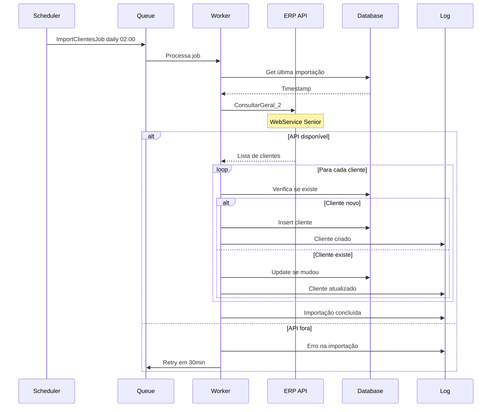
```mermaid
sequenceDiagram
    participant CRON as Scheduler
    participant Q as Queue
    participant W as Worker
    participant ERP as ERP API
    participant DB as Database
    participant LOG as Log
    
    CRON->>Q: ImportClientesJob daily 02:00
    Q->>W: Processa job
    W->>DB: Get última importação
    DB-->>W: Timestamp
    
    W->>ERP: ConsultarGeral_2
    Note over ERP: WebService Senior
    
    alt API disponível
        ERP-->>W: Lista de clientes
        
        loop Para cada cliente
            W->>DB: Verifica se existe
            alt Cliente novo
                W->>DB: Insert cliente
                W->>LOG: Cliente criado
            else Cliente existe
                W->>DB: Update se mudou
                W->>LOG: Cliente atualizado
            end
        end
        
        W->>LOG: Importação concluída
    else API fora
        W->>LOG: Erro na importação
        W->>Q: Retry em 30min
    end
```

---

### **UC8: Importar Interações**

**Descrição do Processo:**
A importação de interações é o processo mais crítico do sistema, pois alimenta a base de dados para cálculo dos KPIs. Cada sistema de origem tem suas particularidades e formatos de dados específicos.

**Fluxo Principal:**
1. Jobs separados são executados para cada sistema de origem:
   - ERP: Faturamentos, orçamentos, propostas (a cada 6 horas)
   - CRM Eleve/Senior: Visitas comerciais (diariamente)
   - Movidesk: Tickets de suporte (a cada hora)
2. Para cada origem, o sistema:
   - Conecta via API específica
   - Busca registros novos ou alterados desde última sincronização
   - Transforma dados para formato padronizado
3. Validações e enriquecimento:
   - Associa interação ao cliente correto
   - Categoriza tipo de interação
4. Após inserir cada interação:
   - Atualiza timestamp de última sincronização
5. Logs detalhados são mantidos para auditoria

**Mapeamento de Dados por Origem:**
ERP → Interação:
- Faturamento MRR - Mensalidade
    - Desenvolver WS no ERP
- Faturamento Serviço
    - Desenvolver WS no ERP
- Orçamentos Serviços
    - Desenvolver WS no ERP
- Propostas Comerciais
    - A ser definido, não são registradas no ERP

CRM Senior → Interação:
- Não tem API pública, precisa realizar mapeamento das rotas diretamente pela aplicação

CRM Eleve → Interação:
- Não tem API pública, precisa realizar mapeamento das rotas diretamente pela aplicação

Movidesk → Interação:
- [Documentação](https://atendimento.movidesk.com/kb/pt-br/article/256/movidesk-ticket-api)
- Cada ticket deve gerar uma interação


**Regras de Negócio:**


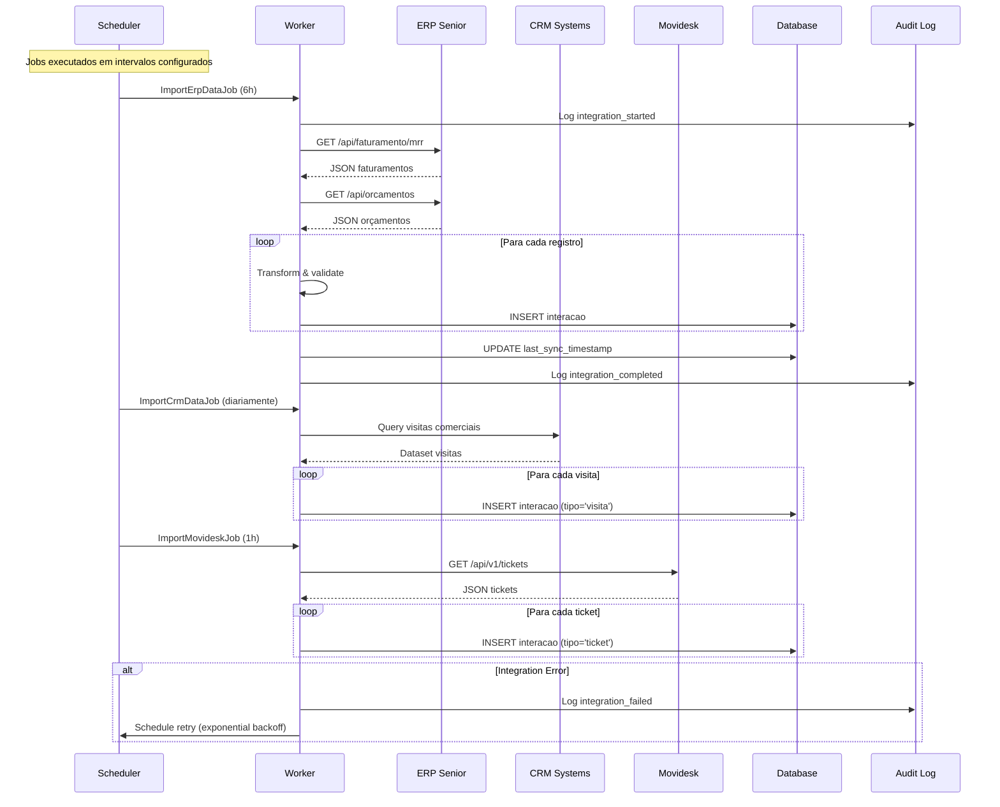
```mermaid
sequenceDiagram
    participant SCH as Scheduler
    participant WRK as Worker
    participant ERP as ERP Senior
    participant CRM as CRM Systems
    participant MVD as Movidesk
    participant DB as Database
    participant LOG as Audit Log
    
    Note over SCH: Jobs executados em intervalos configurados
    
    SCH->>WRK: ImportErpDataJob (6h)
    WRK->>LOG: Log integration_started
    WRK->>ERP: GET /api/faturamento/mrr
    ERP-->>WRK: JSON faturamentos
    WRK->>ERP: GET /api/orcamentos
    ERP-->>WRK: JSON orçamentos
    
    loop Para cada registro
        WRK->>WRK: Transform & validate
        WRK->>DB: INSERT interacao
    end
    
    WRK->>DB: UPDATE last_sync_timestamp
    WRK->>LOG: Log integration_completed
    
    SCH->>WRK: ImportCrmDataJob (diariamente)
    WRK->>CRM: Query visitas comerciais
    CRM-->>WRK: Dataset visitas
    
    loop Para cada visita
        WRK->>DB: INSERT interacao (tipo='visita')
    end
    
    SCH->>WRK: ImportMovideskJob (1h)
    WRK->>MVD: GET /api/v1/tickets
    MVD-->>WRK: JSON tickets
    
    loop Para cada ticket
        WRK->>DB: INSERT interacao (tipo='ticket')
    end
    
    alt Integration Error
        WRK->>LOG: Log integration_failed
        WRK->>SCH: Schedule retry (exponential backoff)
    end
    
```

---

### **UC9: Sincronizar Contatos**

**Descrição do Processo:**
A sincronização de contatos mantém as informações atualizadas em todos os sistemas integrados. Quando um contato é criado ou alterado no CSI, a mudança é propagada para garantir consistência.

**Fluxo Principal:**
1. A ser definido

**Mapeamento de Campos:**
A ser definido

```
A ser definido
```

**Regras de Negócio:**
- A ser definido

```mermaid

```

https://developers.rdstation.com/reference/api-rd-station-doc
https://developers.rdstation.com/reference/contatos
https://developers.rdstation.com/reference/post_platform-contacts

---

### **UC10: Gerenciar Clientes**

**Descrição do Processo:**
A gestão de clientes permite consultar e atualizar informações cadastrais, servindo como ponto central para todas as operações relacionadas ao cliente no sistema.

**Fluxo Principal:**
1. Usuário acessa a lista de clientes com filtros disponíveis:
   - Nome (busca parcial)
   - CNPJ/CPF
   - Código Senior
   - Status (ativo/inativo)
2. Resultados são paginados (20 por página) e ordenáveis
3. Ao clicar em um cliente, uma visão detalhada apresenta:
   - Dados cadastrais completos
   - Lista de contatos
   - Resumo de KPIs
   - Últimas interações
4. Para editar, usuário clica no botão apropriado
5. Formulário permite alterar apenas campos editáveis:
   - Nome fantasia
   - Endereço
   - Telefones
   - Observações
6. Campos protegidos (CNPJ, código Senior) são somente leitura
7. Ao salvar, validações são executadas e log de auditoria criado
8. Botões de ação rápida permitem:
   - Acessar interações do cliente
   - Visualizar relatórios filtrados

**Integrações e Relacionamentos:**
- Cliente é entidade central referenciada por todas as outras
- Alterações em clientes não são propagadas para sistemas externos
- Exclusão de cliente é bloqueada se houver interações

**Regras de Negócio:**
- CNPJ/CPF deve ser válido e único
- Código Senior é gerado pelo ERP e não pode ser alterado
- Clientes inativos não aparecem em seletores mas mantêm histórico

```mermaid
sequenceDiagram
    participant U as Usuário
    participant F as Frontend
    participant API as API
    participant DB as Database
    participant LOG as Audit
    
    U->>F: Acessa lista clientes
    F->>API: GET /api/clients?filters
    API->>DB: Query com filtros
    DB-->>API: Clientes paginados
    API-->>F: JSON response
    
    U->>F: Seleciona cliente
    F->>API: GET /api/clients/{id}
    API->>DB: Query completa
    DB-->>API: Dados do cliente
    API-->>F: Cliente detalhado
    
    U->>F: Edita informações
    F->>API: PUT /api/clients/{id}
    API->>API: Valida CNPJ/CPF
    API->>DB: Update cliente
    API->>LOG: Registra alteração
    API-->>F: Sucesso
    
    U->>F: Acessa interações
    F->>API: GET /api/clients/{id}/interactions
    API->>DB: Query interações
    DB-->>API: Lista ordenada
    API-->>F: Interações do cliente
```

---

### **UC11: Registrar Interações Manuais**

**Descrição do Processo:**
Além das interações importadas automaticamente, o sistema permite registro manual de interações específicas que não estão nos sistemas integrados, como ouvidorias, acionamentos de gestão e pesquisas de satisfação.

**Fluxo Principal:**
1. Usuário acessa o formulário de nova interação
2. Sistema carrega tipos de interação disponíveis para o perfil
3. Usuário seleciona:
   - Cliente (com autocomplete)
   - Tipo de interação
   - Data/hora da ocorrência
   - Temperatura
   - Valor (quando aplicável)
   - Descrição detalhada
4. Validações em tempo real garantem:
   - Data não pode ser futura
   - Descrição mínima de 10 caracteres
5. Ao salvar:
   - Interação é vinculada ao usuário criador
6. Limpa os campos para novo cadastro

**Tipos de Interação Manual:**
- Ouvidoria Senior
- Pesquisa Satisfação
- Status Report
- Passagem Suporte
- Acionamento Gestão/Direção

**Regras de Negócio:**
- Apenas Administradores podem editar
- Descrição é obrigatória

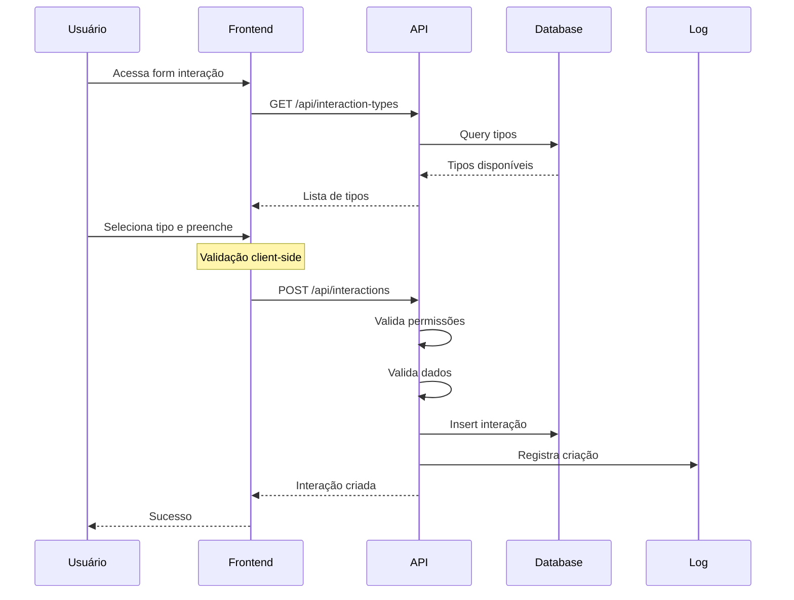
```mermaid
sequenceDiagram
    participant U as Usuário
    participant F as Frontend
    participant API as API
    participant DB as Database
    participant LOG as Log
    
    U->>F: Acessa form interação
    F->>API: GET /api/interaction-types
    API->>DB: Query tipos
    DB-->>API: Tipos disponíveis
    API-->>F: Lista de tipos
    
    U->>F: Seleciona tipo e preenche
    Note over F: Validação client-side
    F->>API: POST /api/interactions
    
    API->>API: Valida permissões
    API->>API: Valida dados
    API->>DB: Insert interação
    API->>LOG: Registra criação
    
    API-->>F: Interação criada
    F-->>U: Sucesso 
```

---

### **UC12: Consultar Agente IA**

**Descrição do Processo:**
O agente de IA permite que usuários façam perguntas em linguagem natural sobre os dados dos clientes, recebendo insights e análises contextualizadas baseadas nas interações e KPIs.

**Fluxo Principal:**
1. A ser definido

**Capacidades do Agente:**
A ser definido

**Regras de Negócio:**
A ser definido

```mermaid    

```

---

### **Fluxo de Autenticação (Comum a Todos)**

**Descrição do Processo:**
A autenticação garante que apenas usuários autorizados acessem o sistema, utilizando JWT tokens para manter a sessão e validar permissões em cada requisição.

**Fluxo Principal:**
1. Usuário acessa qualquer URL do sistema
2. Frontend verifica presença de token válido no localStorage
3. Se não há token ou está expirado:
   - Redireciona para tela de login
   - Usuário informa credenciais
   - Sistema valida contra banco de dados
   - Se válido, gera JWT com claims do usuário
   - Token é armazenado no cliente
4. Todas as requisições subsequentes incluem token no header
5. Backend valida token em cada requisição:
   - Verifica assinatura
   - Checa expiração
   - Carrega permissões do usuário
6. Token é renovado automaticamente quando próximo da expiração

**Segurança:**
- Senhas armazenadas com bcrypt
- Tokens expiram em 8 horas
- Refresh token válido por 7 dias
- Rate limiting no endpoint de login
- Bloqueio após 5 tentativas falhas

```mermaid
sequenceDiagram
    participant U as Usuário
    participant F as Frontend
    participant API as API
    participant AUTH as Auth Service
    participant DB as Database
    
    U->>F: Acessa sistema
    F->>F: Verifica token local
    
    alt Token ausente/expirado
        F->>U: Redirect login
        U->>F: Credenciais
        F->>API: POST /api/login
        API->>DB: Valida credenciais
        DB-->>API: Usuário + perfis
        API->>AUTH: Gera JWT
        AUTH-->>API: Token
        API-->>F: Token + user data
        F->>F: Armazena token
    end
    
    F->>API: Request com Bearer token
    API->>AUTH: Valida token
    AUTH->>DB: Verifica permissões
    DB-->>AUTH: Perfis e KPIs
    AUTH-->>API: Autorizado
    API->>API: Processa request
```

---

### **Fluxo de Tratamento de Erros (Padrão)**

**Descrição do Processo:**
O tratamento padronizado de erros garante experiência consistente e facilita debugging, classificando erros por tipo e severidade.

**Categorias de Erro:**
1. **Validação (422)**: Dados inválidos ou incompletos
2. **Autorização (403)**: Usuário sem permissão
3. **Autenticação (401)**: Token inválido ou expirado
4. **Negócio (400)**: Regra de negócio violada
5. **Sistema (500)**: Erro inesperado

**Fluxo de Tratamento:**
1. Erro ocorre durante processamento
2. Exception handler captura e classifica
3. Para erros de validação/negócio:
   - Retorna mensagem clara ao usuário
   - Log em nível WARNING
4. Para erros de sistema:
   - Retorna mensagem genérica
   - Log completo em nível ERROR
   - Notificação para equipe (se crítico)
5. Todos os erros incluem:
   - Código único para rastreamento
   - Timestamp
   - Contexto da requisição

**Mensagens de Erro Padrão:**
```json
{
  "error": {
    "code": "VALIDATION_ERROR",
    "message": "Dados inválidos",
    "details": {
      "email": ["Email já cadastrado"],
      "cpf": ["CPF inválido"]
    },
    "trace_id": "550e8400-e29b-41d4-a716"
  }
}
```

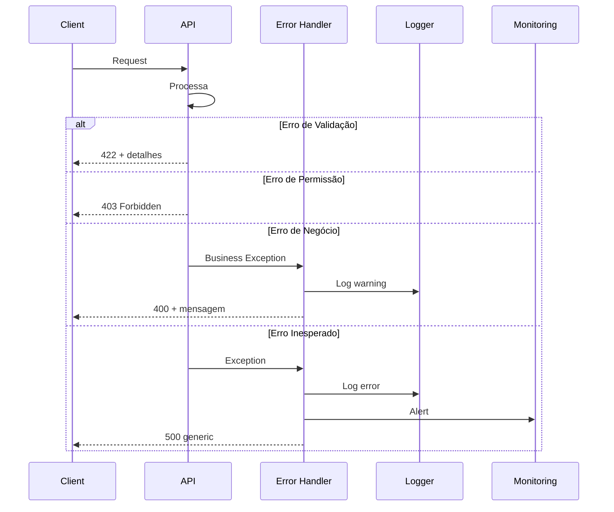
```mermaid
sequenceDiagram
    participant C as Client
    participant API as API
    participant EH as Error Handler
    participant LOG as Logger
    participant MON as Monitoring
    
    C->>API: Request
    API->>API: Processa
    
    alt Erro de Validação
        API-->>C: 422 + detalhes
    else Erro de Permissão
        API-->>C: 403 Forbidden
    else Erro de Negócio
        API->>EH: Business Exception
        EH->>LOG: Log warning
        EH-->>C: 400 + mensagem
    else Erro Inesperado
        API->>EH: Exception
        EH->>LOG: Log error
        EH->>MON: Alert
        EH-->>C: 500 generic
    end
```

---

### **UC15: Gerenciar Contatos (RF-015)**

**Descrição do Processo:**
Este caso de uso permite o gerenciamento completo dos contatos associados aos clientes, incluindo sincronização automática com sistemas externos quando habilitada.

**Fluxo Principal:**
1. Usuário seleciona tenant e cliente (se não for HUB, tenant fica oculto)
2. Sistema carrega contatos existentes com filtros por nome, email ou código
3. Para criar/editar contato, usuário preenche: nome, email, cargo, telefone, tipo perfil, promotor
4. Sistema valida unicidade do email no cliente
5. Ao salvar, dispara sincronização com sistemas externos:
   - ERP Senior (WebService)
   - CRM Eleve (REST API)
   - CRM Senior (REST API) 
   - Movidesk (REST API)
   - RD Station (REST API)
6. Registra log de auditoria da operação

**Regras de Negócio:**
- Email deve ser único por cliente
- Sincronização é assíncrona via jobs
- Falha na sincronização não impede salvamento local
- Sistema registra tentativas de sincronização

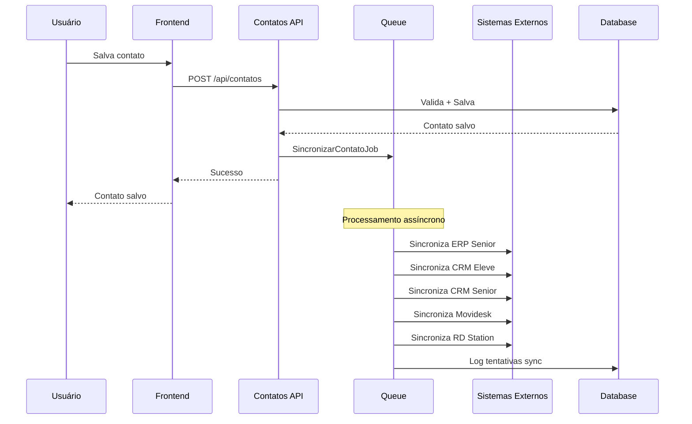
```mermaid
sequenceDiagram
    participant U as Usuário
    participant F as Frontend
    participant API as Contatos API
    participant Q as Queue
    participant EXT as Sistemas Externos
    participant DB as Database
    
    U->>F: Salva contato
    F->>API: POST /api/contatos
    API->>DB: Valida + Salva
    DB-->>API: Contato salvo
    API->>Q: SincronizarContatoJob
    API-->>F: Sucesso
    F-->>U: Contato salvo
    
    Note over Q: Processamento assíncrono
    Q->>EXT: Sincroniza ERP Senior
    Q->>EXT: Sincroniza CRM Eleve
    Q->>EXT: Sincroniza CRM Senior
    Q->>EXT: Sincroniza Movidesk
    Q->>EXT: Sincroniza RD Station
    Q->>DB: Log tentativas sync
```

---

### **UC17: Gestão de Indicadores (RF-017)**

**Descrição do Processo:**
Interface para consulta de indicadores pré-processados no Power BI, oferecendo análises específicas por cliente sem necessidade de cálculos em tempo real.

**Fluxo Principal:**
1. Usuário acessa tela de indicadores
2. Sistema apresenta seletor de cliente
3. Após seleção, sistema consulta Power BI via API
4. Indicadores são exibidos em cards/dashboards:
   - Módulos ativos
   - Mensalidade (MRR)
   - Custo de Servir
   - Módulos Cancelados
   - Inadimplência
5. Interface permite drill-down nos dados quando disponível

**Integração Power BI:**
- Conexão via REST API do Power BI
- Autenticação via Service Principal
- Consulta direta sem cache (conforme ADR-006)
- Fallback para dados históricos em caso de indisponibilidade

**Regras de Negócio:**
- Usuário só vê indicadores de clientes permitidos
- Sistema trata indisponibilidade do BI graciosamente
- Dados são sempre do mês corrente por padrão
- Logs de acesso para auditoria

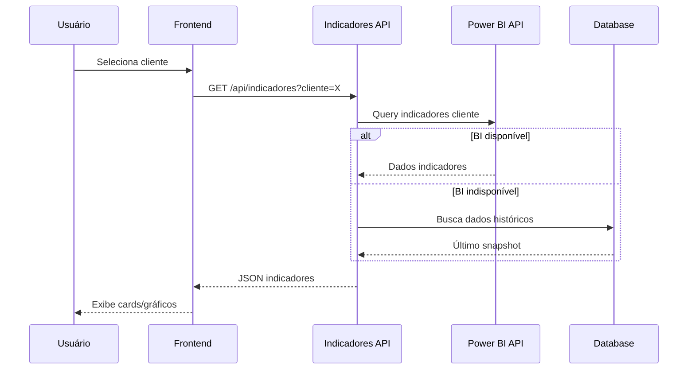
```mermaid
sequenceDiagram
    participant U as Usuário
    participant F as Frontend
    participant API as Indicadores API
    participant BI as Power BI API
    participant DB as Database
    
    U->>F: Seleciona cliente
    F->>API: GET /api/indicadores?cliente=X
    API->>BI: Query indicadores cliente
    alt BI disponível
        BI-->>API: Dados indicadores
    else BI indisponível
        API->>DB: Busca dados históricos
        DB-->>API: Último snapshot
    end
    API-->>F: JSON indicadores
    F-->>U: Exibe cards/gráficos
```

---

### **UC18: Gerenciar Tipos de Interação (RF-018)**

**Descrição do Processo:**
Permite configuração dos tipos de interação disponíveis no sistema, definindo como cada tipo se conecta aos sistemas externos para importação automática.

**Fluxo Principal:**
1. Administrador acessa gestão de tipos de interação
2. Sistema exibe grid com tipos cadastrados, permitindo pesquisa por nome
3. Para criar/editar tipo, usuário define:
   - Código único e nome descritivo
   - Conector (ERP, Movidesk, CRM Eleve, etc.)
   - Configurações específicas do conector:
     - **ERP**: Porta do WebService (ex: sapiens_Synccom_senior_g5_co_ger_relatorio)
     - **Movidesk**: Rota da API (ex: /public/v1/tickets)
4. Interface mostra campos de configuração dinamicamente baseado no conector
5. Botão "Importar Agora" disponível quando conector configurado
6. Ao salvar, valida conectividade se possível

**Configurações por Conector:**
- **1-ERP**: Requer campo "porta" para WebService SOAP
- **2-Movidesk**: Requer campo "rota" para endpoint REST
- **3-CRM Eleve**: Configuração a ser definida

**Regras de Negócio:**
- Código deve ser único por tenant
- Campos de configuração aparecem dinamicamente
- Importação manual só funciona com conector configurado
- Sistema registra quem e quando alterou o tipo

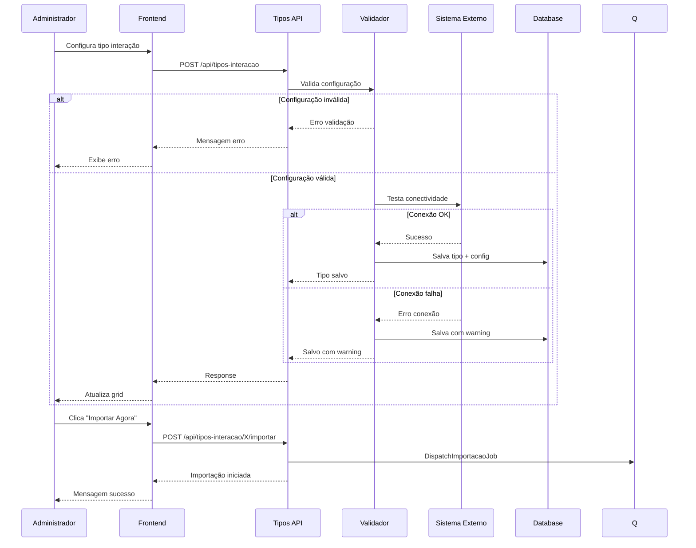
```mermaid
sequenceDiagram
    participant A as Administrador
    participant F as Frontend
    participant API as Tipos API
    participant V as Validador
    participant EXT as Sistema Externo
    participant DB as Database
    
    A->>F: Configura tipo interação
    F->>API: POST /api/tipos-interacao
    API->>V: Valida configuração
    alt Configuração inválida
        V-->>API: Erro validação
        API-->>F: Mensagem erro
        F-->>A: Exibe erro
    else Configuração válida
        V->>EXT: Testa conectividade
        alt Conexão OK
            EXT-->>V: Sucesso
            V->>DB: Salva tipo + config
            V-->>API: Tipo salvo
        else Conexão falha
            EXT-->>V: Erro conexão
            V->>DB: Salva com warning
            V-->>API: Salvo com warning
        end
        API-->>F: Response
        F-->>A: Atualiza grid
    end
    
    A->>F: Clica "Importar Agora"
    F->>API: POST /api/tipos-interacao/X/importar
    API->>Q: DispatchImportacaoJob
    API-->>F: Importação iniciada
    F-->>A: Mensagem sucesso
```

---

## **5. Visão Lógica**

### **5.1 Estrutura de Módulos**

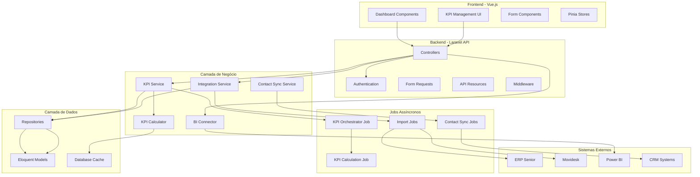
```mermaid
graph TD
    subgraph "Frontend - Vue.js"
        DASH[Dashboard Components]
        KPI_UI[KPI Management UI]
        FORMS[Form Components]
        STORE[Pinia Stores]
    end
    
    subgraph "Backend - Laravel API"
        AUTH[Authentication]
        CTRL[Controllers]
        REQ[Form Requests]
        RES[API Resources]
        MIDDLEWARE[Middleware]
    end
    
    subgraph "Camada de Negócio"
        KPI_SVC[KPI Service]
        CALC[KPI Calculator]
        INT_SVC[Integration Service]
        BI_SVC[BI Connector]
        CONTACT_SVC[Contact Sync Service]
    end
    
    subgraph "Jobs Assíncronos"
        KPI_ORCH[KPI Orchestrator Job]
        KPI_CALC[KPI Calculation Job]
        IMPORT[Import Jobs]
        SYNC[Contact Sync Jobs]
    end
    
    subgraph "Camada de Dados"
        MODEL[Eloquent Models]
        REPO[Repositories]
        DB_CACHE[Database Cache]
    end
    
    subgraph "Sistemas Externos"
        ERP[ERP Senior]
        MOVE[Movidesk] 
        POWER_BI[Power BI]
        CRM[CRM Systems]
    end
    
    DASH --> CTRL
    KPI_UI --> CTRL
    CTRL --> AUTH
    CTRL --> KPI_SVC
    CTRL --> INT_SVC
    CTRL --> BI_SVC
    
    KPI_SVC --> CALC
    KPI_SVC --> KPI_ORCH
    KPI_ORCH --> KPI_CALC
    
    INT_SVC --> IMPORT
    CONTACT_SVC --> SYNC
    
    KPI_SVC --> REPO
    INT_SVC --> REPO
    BI_SVC --> POWER_BI
    
    IMPORT --> ERP
    IMPORT --> MOVE
    SYNC --> CRM
    
    REPO --> MODEL
    CALC --> DB_CACHE
    REPO --> MODEL
```

### **5.2 Principais Classes e Responsabilidades**

#### **Controllers (Camada de Apresentação)**
| Classe | Responsabilidade |
|--------|------------------|
| `TenantController` | Gerenciar tenants do sistema |
| `UserController` | Autenticação e gestão de usuários |
| `ProfileController` | Gerenciar perfis e permissões |
| `KpiController` | CRUD de KPIs e configurações |
| `DashboardController` | Consulta de KPIs calculados para dashboard |
| `ClientController` | CRUD de clientes |
| `ContactController` | Gerenciar contatos dos clientes |
| `InteractionController` | Gerenciar interações manuais |
| `InteractionTypeController` | Configurar tipos de interação |
| `ConnectorController` | Configurar conectores para integração |
| `IndicatorController` | Consultar indicadores do Power BI |
| `LogController` | Consulta e filtragem de logs de auditoria |

#### **Services (Camada de Negócio)**
| Classe | Responsabilidade |
|--------|------------------|
| `KpiService` | Orquestração de KPIs (CRUD + validações) |
| `KpiCalculatorService` | Motor de cálculo de fórmulas de KPIs |
| `KpiOrchestratorService` | Coordena ordem de cálculo por dependências |
| `DashboardService` | Agregação de dados para visualização |
| `IntegrationService` | Coordena importações de sistemas externos |
| `ContactSyncService` | Sincronização de contatos com sistemas legados |
| `PowerBiService` | Conexão e consulta ao Power BI |
| `ErpSeniorService` | Adapter para ERP Senior (SOAP) |
| `MovideskService` | Adapter para Movidesk (REST) |
| `CrmEleveService` | Adapter para CRM Eleve (REST) |

#### **Jobs (Processamento Assíncrono)**
| Classe | Responsabilidade |
|--------|------------------|
| `KpiOrchestratorJob` | Job orquestrador que identifica KPIs para calcular |
| `KpiCalculationJob` | Job que executa cálculo individual de KPI |
| `ImportClientsJob` | Importação de clientes do ERP Senior |
| `ImportInteractionsJob` | Importação de interações por tipo |
| `SyncContactJob` | Sincronização de contato com sistema específico |
| `CleanupLogsJob` | Limpeza periódica de logs antigos |

#### **Models (Camada de Dados)**
| Classe | Responsabilidade |
|--------|------------------|
| `Tenant` | Representa organização no sistema multi-tenant |
| `User` | Usuários do sistema com autenticação |
| `Profile` | Perfis de acesso e permissões |
| `Kpi` | Definição de KPIs por tenant |
| `KpiConfiguration` | Configurações históricas de KPIs |
| `KpiBase` | Base de cálculo de KPIs (dependências) |
| `KpiCalculated` | Valores calculados de KPIs por cliente/data |
| `Client` | Dados dos clientes |
| `Contact` | Contatos dos clientes |
| `Interaction` | Interações registradas |
| `InteractionType` | Tipos de interação configurados |
| `Connector` | Configurações de conectores |
| `Log` | Logs de auditoria e monitoramento |

---

## **6. Visão de Processos**

### **6.1 Processos Principais**

O CSI opera com três tipos principais de processos que trabalham de forma coordenada para garantir a disponibilidade e performance do sistema:


**Descrição dos Processos:**

- **Processo Web**: Responsável por atender todas as requisições HTTP dos usuários. Processa as rotas, executa a lógica de negócio síncrona e retorna as respostas. Para operações pesadas, delega para a fila de processamento.

- **Workers de Alta Prioridade**: Dedicados ao cálculo de KPIs críticos que precisam ser atualizados rapidamente. Garantem que mudanças importantes sejam refletidas no dashboard em tempo hábil.

- **Workers Padrão**: Processam tarefas gerais como envio de notificações, sincronização de contatos e outras operações que não são críticas mas precisam ser executadas em tempo razoável.

- **Workers de Baixa Prioridade**: Focados em importações em massa dos sistemas legados. Como essas operações são pesadas e não urgentes, rodam com menor prioridade para não impactar o sistema.

- **Scheduler**: Executa tarefas periódicas como importações agendadas, limpeza de logs e recálculo programado de KPIs.

### **6.2 Gestão de Filas**

O sistema utiliza filas do Laravel (database driver) para garantir que operações pesadas não bloqueiem a experiência do usuário:

| Fila | Prioridade | Jobs | Workers | Timeout | Retry |
|------|------------|------|---------|---------|-------|
| `high` | Alta | KPI Calculation, Contact Sync | 3 | 5 min | 3x |
| `default` | Média | Import Interactions, Notifications | 2 | 10 min | 3x |
| `low` | Baixa | Import Clients, Log Cleanup | 1 | 30 min | 2x |

**Jobs por Fila:**

**Fila High (Críticos):**
- `KpiCalculationJob`: Cálculo individual de KPI por cliente
- `SyncContactJob`: Sincronização de contato com sistemas externos
- Jobs que afetam diretamente a experiência do usuário

**Fila Default (Padrão):**  
- `ImportInteractionsJob`: Importação de interações por tipo
- `NotificationJob`: Envio de notificações e alertas
- Jobs de processamento geral

**Fila Low (Background):**
- `ImportClientsJob`: Importação em massa de clientes
- `CleanupLogsJob`: Limpeza de logs antigos
- `KpiOrchestratorJob`: Orquestração de cálculo de KPIs

**Estratégia de Processamento:**
- Retry automático com backoff exponencial
- Dead letter queue para jobs que falharam múltiplas vezes  
- Monitoramento via Laravel Horizon
- Circuit breaker para sistemas externos instáveis
- Rate limiting para APIs de terceiros

### **6.3 Agendamento de Tarefas**

O Laravel Scheduler gerencia todas as tarefas periódicas do sistema:

| Job | Frequência | Descrição | Fila |
|-----|------------|-----------|------|
| `KpiOrchestratorJob` | A cada hora | Identifica KPIs que precisam ser recalculados | low |
| `ImportClientsJob` | Diário às 02:00 | Importa clientes do ERP Senior | low |
| `ImportInteractionsJob` | A cada 4 horas | Importa interações de sistemas externos | default |
| `CleanupLogsJob` | Semanal (domingo 01:00) | Remove logs com mais de 90 dias | low |
| `HealthCheckJob` | A cada 15 minutos | Verifica saúde dos sistemas externos | default |
| `BackupDatabaseJob` | Diário às 03:00 | Backup automático do banco de dados | low |

**Configuração CRON Personalizada:**
- KPIs podem ter CRON customizado por configuração
- Expressões CRON validadas na interface
- Logs detalhados de execução para debugging

### **6.4 Fluxo de Processamento Assíncrono**

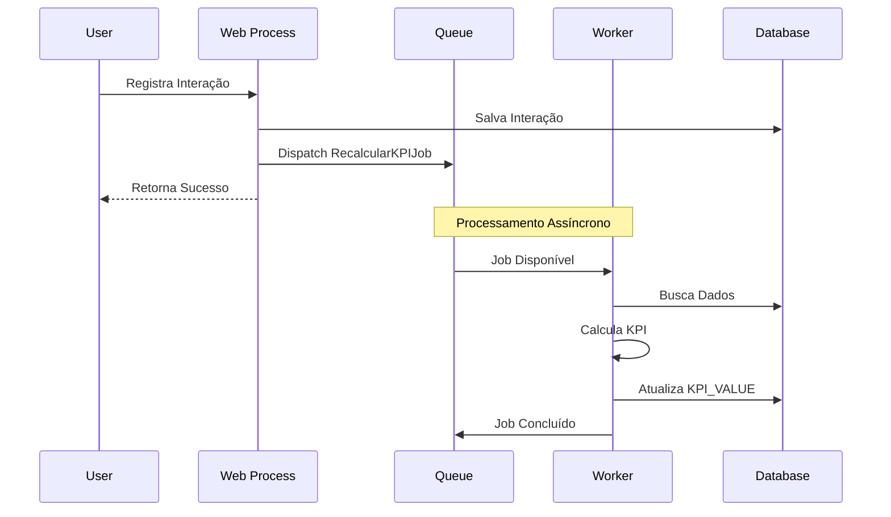
```mermaid
sequenceDiagram
    participant U as User
    participant W as Web Process
    participant Q as Queue
    participant WK as Worker
    participant DB as Database
    
    U->>W: Registra Interação
    W->>DB: Salva Interação
    W->>Q: Dispatch RecalcularKPIJob
    W-->>U: Retorna Sucesso
    
    Note over Q,WK: Processamento Assíncrono
    
    Q->>WK: Job Disponível
    WK->>DB: Busca Dados
    WK->>WK: Calcula KPI
    WK->>DB: Atualiza KPI_VALUE
    WK->>Q: Job Concluído
```

---

## **7. Visão de Implantação**

### **7.1 Infraestrutura Azure**

A aplicação utiliza serviços gerenciados da Azure para minimizar a complexidade operacional:

```mermaid
graph TB
    subgraph "Azure Resources"
        subgraph "Networking"
            VNET[Virtual Network<br/>10.0.0.0/16]
            NSG[Network Security Groups<br/>Firewall Rules]
        end
        
        subgraph "Compute"
            ASP[App Service Plan<br/>B2 Basic]
            WEB[Web App<br/>PHP 8.1]
            JOBS[WebJobs<br/>Background Processing]
        end
        
        subgraph "Data"
            PGSQL[Azure Database for PostgreSQL<br/>Flexible Server B1ms]
            BLOB[Storage Account<br/>Standard LRS]
        end
        
        subgraph "Monitoring"
            AI[Application Insights<br/>Performance & Logs]
            LA[Log Analytics<br/>Centralized Logging]
        end
    end
    
    Internet --> WEB
    WEB --> PGSQL
    WEB --> BLOB
    WEB --> AI
    JOBS --> PGSQL
    JOBS --> AI
```

**Justificativa da Infraestrutura Simplificada:**
- Sem Load Balancer: Com poucos usuários iniciais, o App Service gerencia a carga adequadamente
- Sem Redis Cache: KPIs pré-calculados eliminam necessidade de cache complexo (ver ADR-006)
- Serviços Basic Tier: Adequados para a carga inicial, com possibilidade de upgrade

### **7.2 Especificações de Recursos**

| Recurso | Tipo | Especificação | Justificativa |
|---------|------|---------------|---------------|
| App Service | B2 | 2 cores, 3.5GB RAM | Adequado para 50 usuários simultâneos |
| PostgreSQL | B1ms | 1 vCore, 2GB RAM | Suporta carga inicial prevista |
| Storage | Standard LRS | 100GB | Logs e uploads de arquivos |
| App Insights | Basic | Pay-as-you-go | Monitoramento essencial |

**Estratégia de Scaling:**
- Vertical scaling inicial (upgrade de tiers)
- Alertas configurados para 80% de utilização de recursos

### **7.3 Configuração de Deployment**

O deployment deve ser automatizado via Azure DevOps com estratégia blue-green simplificada.

### **7.4 Configuração de Segurança**

```yaml
Network Security:
  - HTTPS only (TLS 1.2+)
  
Application Security:
  - CORS configurado para domínios Sancon
  - Rate limiting: 60 requests/minute
  - Session timeout: 2 horas
  
Database Security:
  - Conexão SSL obrigatória
  - Firewall para IPs Azure
```

---

## **8. Visão de Implementação**

### **8.1 Estrutura de Código**

A organização modular facilita a manutenção e evolução do sistema:

```

```

### **8.2 Dependências Principais**

O projeto utiliza packages consolidados do ecossistema Laravel:

```json
{
  "require": {
    "php": "^8.1",
    "laravel/framework": "^10.0",
    "inertiajs/inertia-laravel": "^0.6",
    "spatie/laravel-permission": "^5.0",
    "guzzlehttp/guzzle": "^7.0",
    "spatie/laravel-query-builder": "^5.0",
    "spatie/laravel-data": "^3.0",
    "laravel/horizon": "^5.0"
  },
  "require-dev": {
    "phpunit/phpunit": "^10.0",
    "laravel/dusk": "^7.0",
    "barryvdh/laravel-debugbar": "^3.0",
    "nunomaduro/larastan": "^2.0",
    "laravel/pint": "^1.0"
  }
}
```

**Justificativa das Dependências:**
- `spatie/laravel-permission`: RBAC robusto e testado
- `spatie/laravel-query-builder`: Filtros e ordenação padronizados
- `spatie/laravel-data`: DTOs type-safe
- `laravel/horizon`: Dashboard para monitorar filas

### **8.3 Padrões de Código**

#### **Service Pattern com Injeção de Dependência**


#### **Repository Pattern**


---

## **9. Visão de Dados**

### **9.1 Modelo de Dados Conceitual**

O modelo de dados foi projetado para suportar a flexibilidade necessária para diferentes tipos de KPIs e interações:

```mermaid
erDiagram
    USER ||--o{ USER_PROFILE : has
    PROFILE ||--o{ USER_PROFILE : belongs
    PROFILE ||--o{ PROFILE_KPI : has
    KPI ||--o{ PROFILE_KPI : belongs
    
    CLIENT ||--o{ INTERACTION : has
    CLIENT ||--o{ CONTACT : has
    CLIENT ||--o{ KPI_VALUE : has
    
    INTERACTION_TYPE ||--o{ INTERACTION : categorizes
    KPI ||--o{ KPI_VALUE : calculates
    
    USER {
        int id PK
        string name
        string email UK
        string password
        boolean active
        timestamp created_at
        timestamp updated_at
    }
    
    PROFILE {
        int id PK
        string name UK
        string description
        boolean active
        timestamp created_at
    }
    
    CLIENT {
        int id PK
        string code UK
        string name
        string cnpj_cpf UK
        string senior_code
        boolean active
        json metadata
        timestamp created_at
    }
    
    KPI {
        int id PK
        string name UK
        string slug UK
        string type
        string formula
        string calculation_frequency
        json configuration
        boolean active
    }
    
    INTERACTION {
        int id PK
        int client_id FK
        int type_id FK
        datetime date
        decimal value
        text description
        int temperature
        json extra_data
        timestamp created_at
        int created_by FK
    }
    
    KPI_VALUE {
        int id PK
        int client_id FK
        int kpi_id FK
        decimal value
        date calculated_for_date
        json calculation_details
        timestamp calculated_at
    }
```

### **9.2 Estratégia de Índices**

Índices otimizados para as queries mais frequentes.

### **9.3 Política de Retenção e Arquivamento**

Como os dados são valiosos para análise histórica, implementamos uma estratégia de retenção escalonada:

| Tabela | Retenção Online | Arquivamento | Exclusão |
|--------|-----------------|--------------|----------|
| interactions | 1 ano | Azure Blob após 1 anos | Nunca |
| kpi_values | 1 ano | Azure Blob após 1 ano | Após 5 anos |
| logs | 90 dias | - | Após 90 dias |


---

## **12. Decisões Arquiteturais**

### **12.1 Registro de Decisões (ADR)**

#### **ADR-006: Não Utilizar Cache Redis**
- **Status**: Aceito
- **Contexto**: KPIs são pré-calculados e armazenados em banco. Dashboard consulta valores já calculados.
- **Decisão**: Não implementar cache Redis na fase inicial
- **Consequências**: 
  - ✅ Redução de complexidade e custo
  - ✅ Menos pontos de falha
  - ✅ Dados sempre consistentes
  - ❌ Possível latência adicional (mitigada por índices adequados)
  - ❌ Maior carga no banco (aceitável para volume inicial)

#### **ADR-007: App Service Único sem Load Balancer**
- **Status**: Aceito
- **Contexto**: Aplicação iniciará com poucos usuários (< 50 simultâneos)
- **Decisão**: Usar único App Service sem load balancer
- **Consequências**:
  - ✅ Custo reduzido (economia de ~60%)
  - ✅ Deployment mais simples
  - ✅ Menos complexidade operacional
  - ❌ Single point of failure (mitigado por auto-restart do App Service)
  - ❌ Scaling limitado (upgrade vertical disponível)

#### **ADR-008: Banco de Dados Relacional para Tudo**
- **Status**: Aceito
- **Contexto**: Dados estruturados, necessidade de ACID, queries complexas
- **Decisão**: PostgreSQL para todos os dados, incluindo logs de auditoria
- **Consequências**:
  - ✅ Única tecnologia para gerenciar
  - ✅ Transações ACID garantidas
  - ✅ JSONB para dados semi-estruturados
  - ❌ Possível gargalo futuro para logs (aceitável com particionamento)

#### **ADR-009: Monolito Modular vs Microserviços**
- **Status**: Aceito
- **Contexto**: Equipe pequena, prazo apertado, requisitos de performance moderados
- **Decisão**: Arquitetura monolítica com organização modular
- **Consequências**:
  - ✅ Time-to-market acelerado
  - ✅ Debugging simplificado
  - ✅ Transações simples
  - ❌ Escalabilidade limitada (suficiente para requisitos atuais)
  - ❌ Deploy afeta todo sistema (mitigado com CI/CD e testes)

---
