##### **Informações do Documento**
- **Projeto:** CSI - Customer Success Intelligence
- **Versão:** 2.0
- **Data:** 29/09/2025
- **Autor(es):** Luan Felipe Tavares
- **Ferramenta de Diagramação:** Mermaid

### **Documentos Relacionados**
- [Documentação de Requisitos do CSI v1.0](./1%20Documentação%20de%20Requisitos%20do%20CSI%20v1.0.md)
- [Documento de Arquitetura de Software](./2%20Documento%20de%20Arquitetura%20de%20Software.md)
- [Especificações Técnicas](./4%20Especificações%20Técnicas.md)
- [Documentação da Estrutura](./5%20Documentação%20da%20Estrutura.md)
- [Sistema de Permissões](./6%20Sistema%20de%20Permissões.md)

### **Histórico de Revisões**
| Versão | Data | Autor | Descrição das Alterações |
|--------|------|-------|-----------------------|
| 1.0 | 15/07/2025 | Luan Tavares | Versão inicial dos diagramas |
| 1.1 | 15/07/2025 | Luan Tavares | Adicionados diagramas C4, sequência e implantação |
| 2.0 | 29/09/2025 | Luan Tavares | Alinhamento com requisitos v1.0 e DAS v2.0: - Incluídos KPIs no MVP - Adicionado Power BI - Removido Redis (ADR-006) - Movidas integrações CRM/RD para V2 - Adicionados diagramas de KPI |iagramas Arquiteturais**

### **Informações do Documento**
- **Projeto:** CSI - Customer Success Intelligence
- **Versão:** 1.1
- **Data:** 15/07/2025
- **Autor(es):** Luan Felipe Tavares
- **Ferramenta de Diagramação:** Mermaid

### **Documentos Relacionados**
- [Documentação de Requisitos do CSI v1.0](./1%20Documentação%20de%20Requisitos%20do%20CSI%20v1.0.md)
- [Documento de Arquitetura de Software](./2%20Documento%20de%20Arquitetura%20de%20Software.md)
- [Especificações Técnicas](./4%20Especificações%20Técnicas.md)

### **Histórico de Revisões**
| Versão | Data | Autor | Descrição das Alterações |
|--------|------|-------|-------------------------|
| 1.0 | 15/07/2025 | Luan Tavares | Versão inicial dos diagramas |
| 1.1 | 15/07/2025 | Luan Tavares | Adicionados diagramas C4, sequência e implantação |

---

## **1. Introdução**

### **1.1 Objetivo**
Este documento apresenta os diagramas arquiteturais do sistema CSI (Customer Success Intelligence), fornecendo diferentes visões e níveis de abstração para compreensão completa da arquitetura multi-tenant baseada em Laravel/Vue.js hospedada no Azure, incluindo o sistema de KPIs configuráveis e integrações com Power BI.

### **1.2 Notações e Convenções**
| Elemento | Representação | Descrição |
|----------|---------------|-----------|
| Sistema CSI | Retângulo azul | Sistema principal sendo documentado |
| Sistemas MVP | Retângulo verde | APIs e sistemas incluídos no MVP |
| Sistemas V2 | Retângulo cinza tracejado| APIs e sistemas para versão futura |
| Usuários | Ícone de pessoa | Atores do sistema (HUB, Admin, Usuário) |
| Banco de Dados | Cilindro | PostgreSQL (sem cache Redis) |
| Componentes | Retângulo verde | Módulos internos do Laravel/Vue |
| Azure Services | Retângulo roxo | Serviços da Microsoft Azure |
| Power BI | Retângulo amarelo | Fonte de indicadores pré-processados |

---

## **2. Diagrama de Contexto (C4 - Nível 1)**

### **2.1 Descrição**
Visão de mais alto nível mostrando como o sistema CSI se relaciona com usuários e sistemas externos no contexto organizacional.

### **2.2 Diagrama**

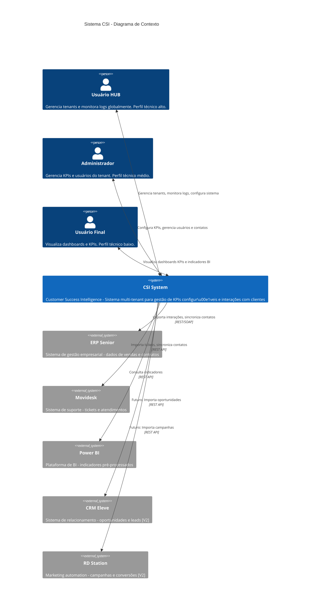

### **2.3 Elementos do Diagrama**

| Elemento | Tipo | Descrição | Tecnologia | Escopo |
|----------|------|-----------|------------|---------|
| Usuário HUB | Ator | Administrador global do sistema | Interface Web | MVP |
| Administrador | Ator | Administrador do tenant | Interface Web | MVP |
| Usuário Final | Ator | Usuário que visualiza KPIs | Interface Web | MVP |
| CSI System | Sistema | Sistema principal multi-tenant | Laravel + Vue.js | MVP |
| ERP Senior | Sistema Externo MVP | Sistema de gestão empresarial | REST/SOAP API | MVP |
| Movidesk | Sistema Externo MVP | Sistema de suporte | REST API | MVP |
| Power BI | Sistema Externo MVP | Plataforma de BI | REST API | MVP |
| CRM Eleve | Sistema Externo V2 | CRM para oportunidades | REST API | V2 |
| RD Station | Sistema Externo V2 | Automação de marketing | REST API | V2 |

### **2.4 Integrações por Escopo**

**Integrações do MVP:**
| Sistema Externo | Protocolo | Tipo de Integração | Criticidade | Funcionalidade |
|-----------------|-----------|-------------------|-------------|----------------|
| ERP Senior | REST/SOAP | Assíncrona (Jobs) | Alta | Importação de interações e clientes |
| Movidesk | REST | Assíncrona (Jobs) | Média | Importação de tickets de suporte |
| Power BI | REST | Síncrona | Média | Consulta de indicadores pré-processados |

**Integrações Futuras (V2):**
| Sistema Externo | Protocolo | Tipo de Integração | Criticidade | Funcionalidade |
|-----------------|-----------|-------------------|-------------|----------------|
| CRM Eleve | REST | Assíncrona (Jobs) | Alta | Importação de oportunidades e leads |
| RD Station | REST | Assíncrona (Jobs) | Média | Importação de campanhas de marketing |

**Funcionalidades de Sincronização (MVP):**
- **Contatos**: Sincronização bidirecional com ERP Senior e Movidesk
- **KPIs**: Cálculo automático baseado em interações importadas
- **Indicadores**: Consulta em tempo real ao Power BI

---

## **3. Diagrama de Componentes (C4 - Nível 2)**

### **3.1 Descrição**
Decompõe o sistema CSI em seus componentes internos e suas interações, mostrando a arquitetura Laravel/Vue.js.

### **3.2 Diagrama**

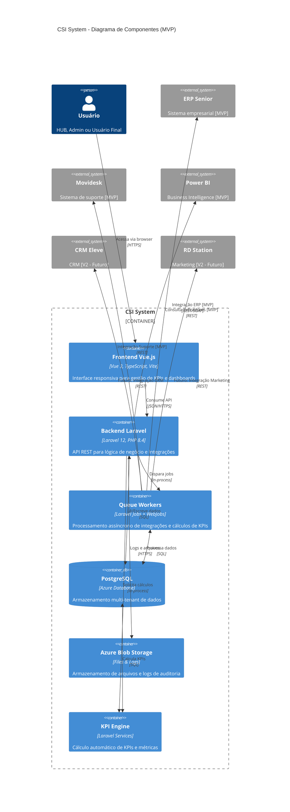

### **3.3 Componentes Principais (MVP)**

| Componente | Responsabilidade | Tecnologia | Dependências | Escopo |
|------------|------------------|------------|--------------|---------|
| Frontend Vue.js | Interface do usuário, dashboards | Vue 3, TypeScript, Vite | Backend API | MVP |
| Backend Laravel | API REST, autenticação, RBAC | Laravel 12, PHP 8.4 | Database, Storage | MVP |
| Queue Workers | Integrações assíncronas | Laravel Jobs + Azure WebJobs | Database, APIs Externas | MVP |
| KPI Engine | Cálculo automático de KPIs | Laravel Services | Database | MVP |
| PostgreSQL | Persistência multi-tenant | Azure Database for PostgreSQL | - | MVP |
| Azure Blob Storage | Arquivos e logs de auditoria | Azure Storage | - | MVP |

**Nota sobre Redis**: Conforme definido na ADR-006, o sistema **não utiliza Redis** para simplificar a arquitetura e reduzir a complexidade operacional.

### **3.4 Interfaces entre Componentes (MVP)**

| Interface | De | Para | Protocolo | Formato | Tipo |
|-----------|-----|------|-----------|---------|------|
| REST API | Frontend | Backend | HTTPS | JSON | Síncrona |
| Database Connection | Backend | PostgreSQL | TCP | SQL | Síncrona |
| Storage API | Backend | Blob Storage | HTTPS | Binary | Síncrona |
| Job Queue | Backend | Queue Workers | In-process | Objects | Assíncrona |
| KPI Calculation | Backend | KPI Engine | In-process | Objects | Síncrona |
| ERP Integration | Queue Workers | ERP Senior | HTTPS | REST/SOAP | Assíncrona |
| Support Integration | Queue Workers | Movidesk | HTTPS | JSON | Assíncrona |
| BI Integration | Backend | Power BI | HTTPS | JSON | Síncrona |

---

## **4. Diagrama de Implantação**

### **4.1 Descrição**
Mostra como o sistema CSI é implantado na infraestrutura Microsoft Azure.

### **4.2 Diagrama - Ambiente de Produção**

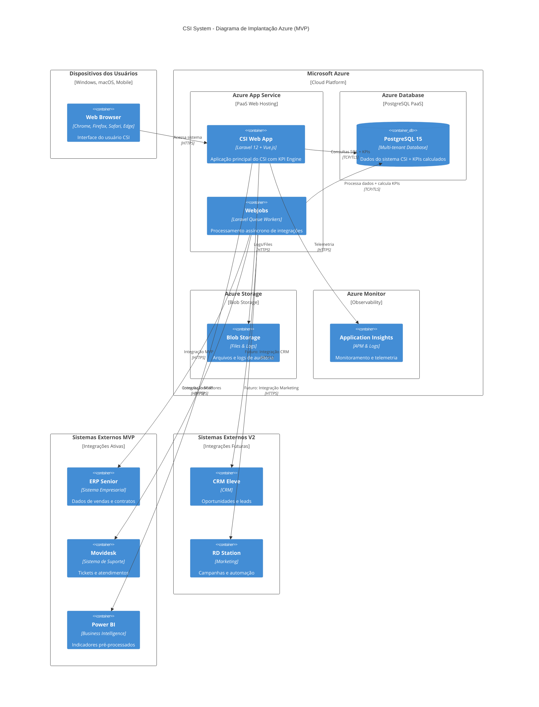

### **4.3 Especificações de Infraestrutura (MVP)**

| Componente | Tipo | Especificação | Quantidade | Ambiente | Observações |
|------------|------|---------------|------------|----------|-------------|
| App Service | Azure Web App | Standard S1 (1 vCPU, 1.75GB) | 1 (auto-scaling) | Produção | Com KPI Engine integrado |
| WebJobs | Azure WebJobs | Integrado ao App Service | 2-5 workers | Produção | Para integrações MVP |
| PostgreSQL | Azure Database | Basic (2 vCores, 50GB) | 1 (backup geo) | Produção | Multi-tenant + KPIs |
| Blob Storage | Azure Storage | Standard LRS | 1 account | Produção | Logs e auditoria |
| Application Insights | Azure Monitor | Standard | 1 | Produção | Monitoramento completo |

**Recursos Removidos**: Conforme ADR-006, **Redis Cache não é utilizado** para simplificar a arquitetura.

### **4.4 Configurações de Rede**

| Recurso | Configuração | Descrição |
|---------|--------------|-----------|
| App Service | HTTPS Only | Força conexões seguras |
| Database | Private Endpoint | Acesso restrito via rede privada |
| Storage | Firewall Rules | Acesso apenas do App Service |
| Cache | TLS 1.2 | Conexões criptografadas |

### **4.5 Ambientes**

| Ambiente | Propósito | Infraestrutura | URL |
|----------|-----------|----------------|-----|
| Desenvolvimento | Desenvolvimento local | Docker Compose | http://localhost:3000 |
| Homologação | Testes integrados | Azure (reduzida) | https://csi-staging.azurewebsites.net |
| Produção | Ambiente final | Azure (completa) | https://csi.cliente.com.br |

---

## **5. Diagramas de Sequência**

### **5.1 Fluxo de Autenticação Multi-Tenant**

#### **5.1.1 Descrição**
Processo de login do usuário no sistema CSI com validação de tenant e perfil de acesso.

#### **5.1.2 Diagrama**

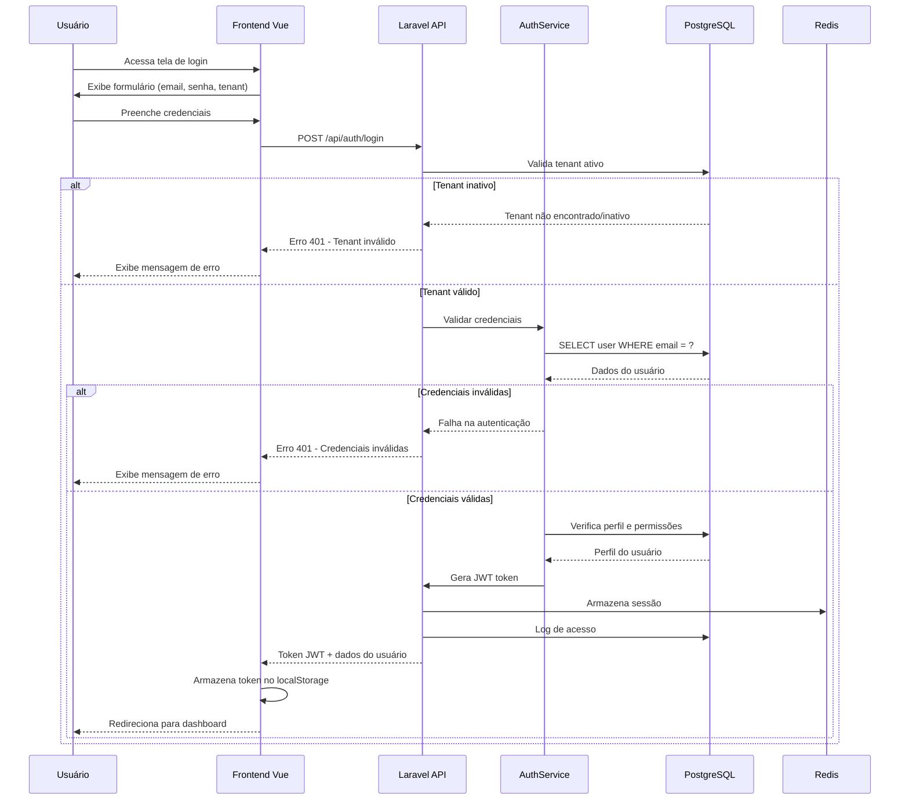

### **5.2 Fluxo de Cálculo de KPI (MVP)**

#### **5.2.1 Descrição**
Processo de cálculo automático de KPI através de job assíncrono com integração de dados externos do MVP.

#### **5.2.2 Diagrama**

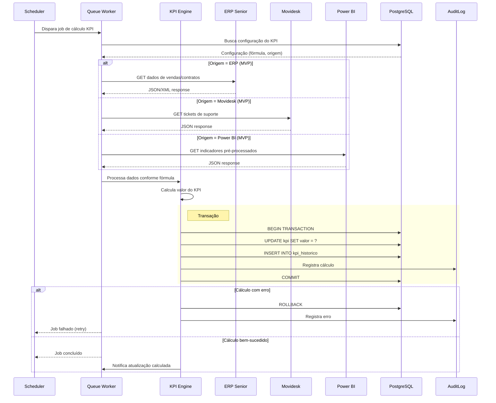

### **5.3 Fluxo de Gestão de Tenants (HUB)**

#### **5.3.1 Descrição**
Processo de criação de novo tenant pelo usuário HUB com isolamento de dados.

#### **5.3.2 Diagrama**

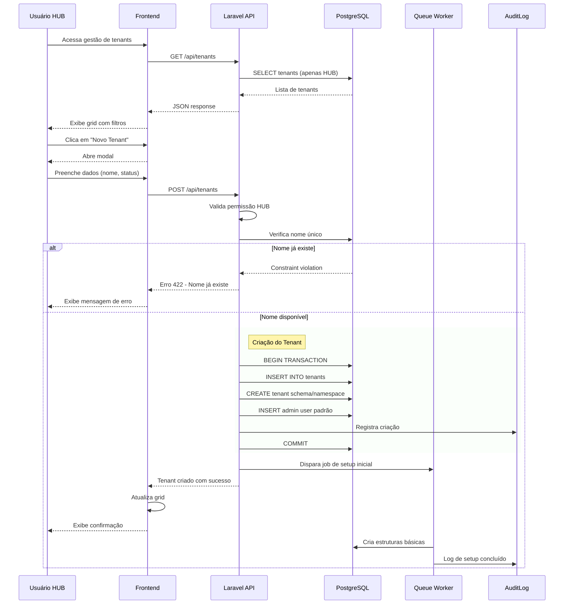

### **5.4 Fluxo de Importação de Dados Externos (MVP)**

#### **5.4.1 Descrição**
Processo de importação de dados de sistemas externos MVP com tratamento de erro e log de auditoria (sem Redis conforme ADR-006).

#### **5.4.2 Diagrama**

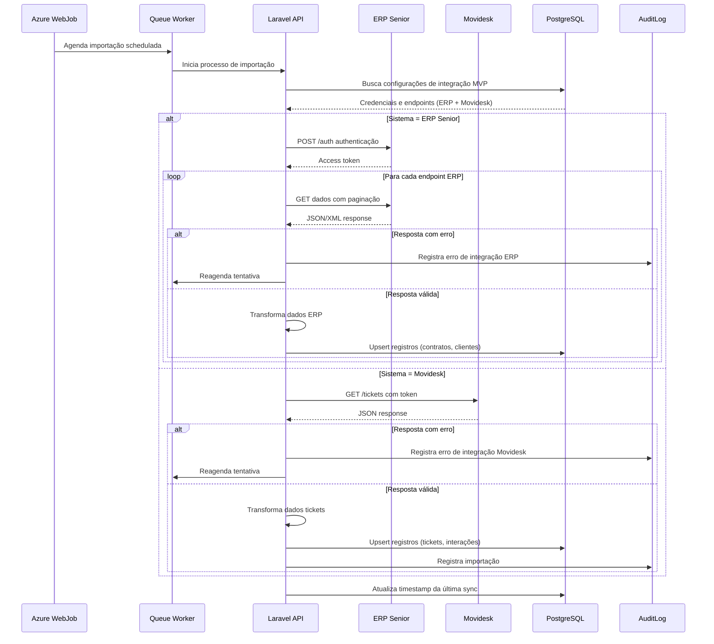
---

## **6. Diagrama de Classes (Principais Entidades)**

### **6.1 Descrição**
Representa as principais entidades do modelo de dados do sistema CSI e seus relacionamentos.

### **6.2 Diagrama**

```mermaid
classDiagram
    class Tenant {
        +int id
        +string nome
        +boolean ativo
        +timestamp created_at
        +timestamp updated_at
        +timestamp deleted_at
    }

    class User {
        +int id
        +int tenant_id
        +string name
        +string email
        +string password
        +enum perfil
        +boolean ativo
        +timestamp created_at
        +timestamp updated_at
    }

    class Cliente {
        +int id
        +int tenant_id
        +string nome
        +string cnpj_cpf
        +string email
        +enum tipo
        +enum status
        +json dados_adicionais
        +timestamp created_at
        +timestamp updated_at
        +timestamp deleted_at
    }

    class Kpi {
        +int id
        +int tenant_id
        +string nome
        +string descricao
        +enum tipo_calculo
        +enum origem_calculo
        +string formula
        +json configuracao
        +decimal valor_atual
        +timestamp ultima_atualizacao
        +boolean ativo
        +timestamp created_at
        +timestamp updated_at
        +timestamp deleted_at
    }

    class KpiHistorico {
        +int id
        +int kpi_id
        +decimal valor
        +json dados_calculo
        +timestamp periodo_inicio
        +timestamp periodo_fim
        +timestamp created_at
    }

    class Interacao {
        +int id
        +int tenant_id
        +int cliente_id
        +enum tipo
        +enum origem
        +string titulo
        +text descricao
        +json dados_origem
        +timestamp data_interacao
        +timestamp created_at
        +timestamp updated_at
    }

    class LogAuditoria {
        +int id
        +int tenant_id
        +int user_id
        +string acao
        +string entidade
        +int entidade_id
        +json dados_antes
        +json dados_depois
        +string ip_address
        +string user_agent
        +timestamp created_at
    }

    class IntegracaoConfig {
        +int id
        +int tenant_id
        +enum sistema
        +string endpoint
        +json credenciais
        +json configuracoes
        +boolean ativo
        +timestamp ultima_sync
        +timestamp created_at
        +timestamp updated_at
    }
```

### **6.3 Relacionamentos Principais**

| Relacionamento | Cardinalidade | Descrição |
|---------------|---------------|-----------|
| Tenant → User | 1:N | Um tenant possui muitos usuários |
| Tenant → Cliente | 1:N | Um tenant possui muitos clientes |
| Tenant → Kpi | 1:N | Um tenant possui muitos KPIs |
| Tenant → Interacao | 1:N | Um tenant possui muitas interações |
| Tenant → LogAuditoria | 1:N | Um tenant possui muitos logs |
| User → LogAuditoria | 1:N | Um usuário gera muitos logs |
| Cliente → Interacao | 1:N | Um cliente possui muitas interações |
| Kpi → KpiHistorico | 1:N | Um KPI possui muito histórico |

### **6.4 Enumerações Principais**

| Enum | Valores | Descrição |
|------|---------|-----------|
| user.perfil | HUB, ADMIN, USER | Perfis de acesso ao sistema |
| cliente.tipo | PF, PJ | Pessoa Física ou Jurídica |
| cliente.status | ATIVO, INATIVO, PROSPECT | Status do relacionamento |
| kpi.tipo_calculo | SOMA, MEDIA, CONTAGEM, PERCENTUAL | Tipo de cálculo |
| kpi.origem_calculo | ERP_SENIOR, MOVIDESK, POWER_BI, MANUAL | Origem dos dados (MVP) |
| interacao.tipo | VENDA, SUPORTE, MARKETING, OUVIDORIA | Tipo de interação |
| interacao.origem | ERP_SENIOR, MOVIDESK, MANUAL | Sistema de origem (MVP) |

---

## **7. Diagrama de Arquitetura Multi-Tenant**

### **7.1 Descrição**
Demonstra a estratégia de isolamento de dados multi-tenant utilizando shared database, shared schema.

### **7.2 Diagrama**

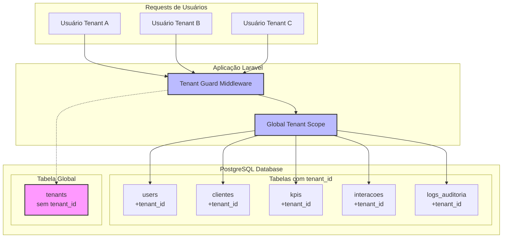

### **7.3 Estratégia de Isolamento**

| Componente | Estratégia | Implementação |
|------------|------------|---------------|
| Database | Shared Database | Single PostgreSQL instance |
| Schema | Shared Schema | Todas as tabelas no mesmo schema |
| Data Isolation | Row Level Security | tenant_id em todas as tabelas |
| Application | Global Scope | Eloquent Global Scope automático |
| Authentication | Tenant Context | JWT token inclui tenant_id |
| Authorization | RBAC per Tenant | Permissões isoladas por tenant |

---

## **8. Diagrama de Fluxo de Monitoramento e Logs**

### **8.1 Descrição**
Fluxo de coleta, processamento e visualização de logs e métricas para usuários HUB.

### **8.2 Diagrama**

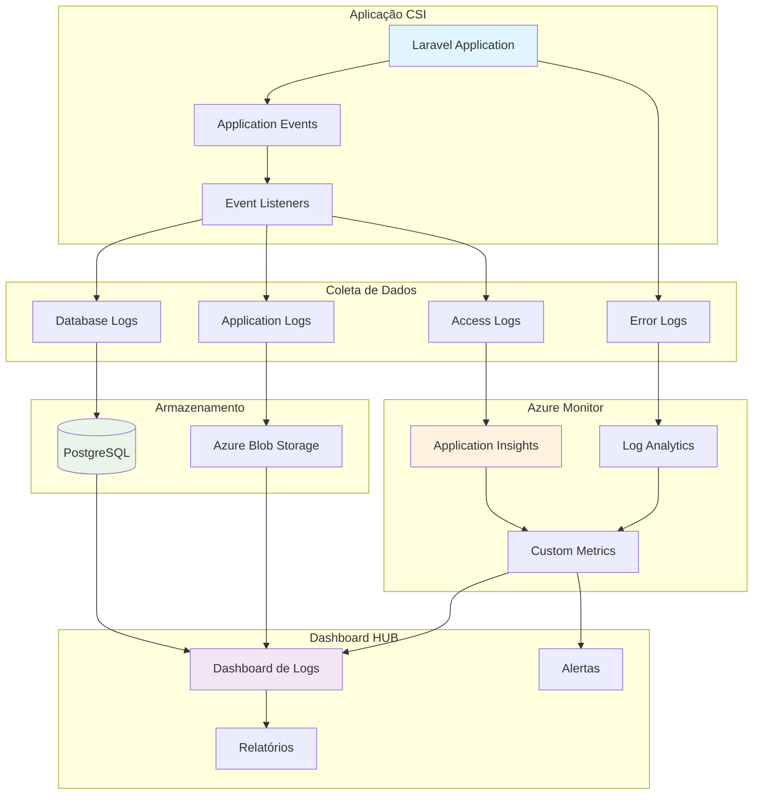

### **8.3 Tipos de Logs Coletados**

| Tipo | Origem | Destino | Retenção |
|------|--------|---------|----------|
| Auditoria | User Actions | PostgreSQL | 2 anos |
| Aplicação | Laravel Logs | Blob Storage | 6 meses |
| Acesso | HTTP Requests | Application Insights | 3 meses |
| Performance | APM | Application Insights | 3 meses |
---

## **9. Diagrama de Integração com Sistemas Externos**

### **9.1 Descrição**
Fluxo de integração com os sistemas externos, mostrando as diferentes APIs e protocolos utilizados.

### **9.2 Diagrama**

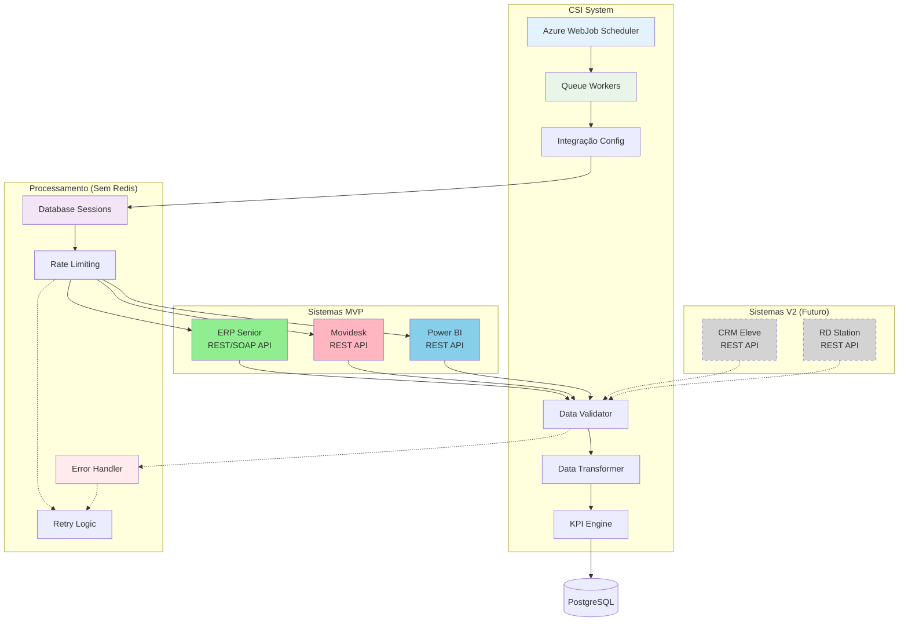

### **9.3 Especificações de Integração (MVP)**

**Integrações Ativas (MVP):**
| Sistema | Protocolo | Autenticação | Frequência | Rate Limit | Funcionalidade |
|---------|-----------|--------------|------------|------------|----------------|
| ERP Senior | REST/SOAP | API Key + OAuth | 4x/dia | 100 req/min | Contratos, clientes, vendas |
| Movidesk | REST | Token | 6x/dia | 120 req/min | Tickets, interações |
| Power BI | REST | Bearer Token | Sob demanda | 60 req/min | Indicadores pré-processados |

**Integrações Futuras (V2):**
| Sistema | Protocolo | Autenticação | Frequência | Rate Limit | Funcionalidade |
|---------|-----------|--------------|------------|------------|----------------|
| CRM Eleve | REST | Bearer Token | 2x/dia | 60 req/min | Oportunidades, leads |
| RD Station | REST | OAuth 2.0 | 1x/dia | 300 req/hora | Campanhas, automação |

**Nota**: Conforme ADR-006, não há cache Redis - todas as sessões e dados temporários são gerenciados via PostgreSQL.

---

## **10. Considerações de Implementação**

### **10.1 Validação dos Diagramas**
Todos os diagramas apresentados neste documento foram validados contra:
- ✅ Documento de Arquitetura de Software (v2.0)
- ✅ Documentação de Requisitos do CSI (v1.0)
- ✅ ADR-006 (Decisão de não usar Redis)
- ✅ Configurações de infraestrutura Azure
- ✅ Escopo MVP vs V2 definido

### **10.2 Ferramentas Utilizadas**
- **Mermaid**: Para criação de todos os diagramas
- **C4 Model**: Para diagramas de contexto e componentes
- **UML**: Para diagramas de sequência e classes
- **Markdown**: Para documentação estruturada

### **10.3 Manutenção dos Diagramas**
Os diagramas devem ser atualizados sempre que houver:
- Mudanças na arquitetura do sistema
- Novas integrações com sistemas externos
- Alterações nos fluxos de negócio
- Modificações na infraestrutura Azure
- Atualizações de tecnologias (Laravel, Vue.js, etc.)

### **10.4 Próximos Passos**
1. **Validação com a Equipe**: Revisar diagramas com desenvolvedores
2. **Documentação de APIs**: Detalhar especificações das APIs REST
3. **Diagramas de Segurança**: Adicionar fluxos específicos de segurança
4. **Performance**: Incluir diagramas de otimização e cache
5. **Disaster Recovery**: Documentar procedimentos de backup/restore

### **10.5 Referências**
- [Documento de Arquitetura de Software v2.0](./2%20Documento%20de%20Arquitetura%20de%20Software.md)
- [Documentação de Requisitos do CSI v1.0](./1%20Documentação%20de%20Requisitos%20do%20CSI%20v1.0.md)
- [Documentação da Estrutura](./5%20Documentação%20da%20Estrutura.md)
- [Sistema de Permissões](./6%20Sistema%20de%20Permissões.md)
- [C4 Model Documentation](https://c4model.com/)
- [Mermaid Documentation](https://mermaid.js.org/)
- [Laravel 12 Architecture](https://laravel.com/docs/12.x/architecture)
- [Vue.js 3 Guide](https://vuejs.org/guide/)
- [Azure Architecture Center](https://docs.microsoft.com/en-us/azure/architecture/)
- [Power BI REST API](https://docs.microsoft.com/en-us/rest/api/power-bi/)
